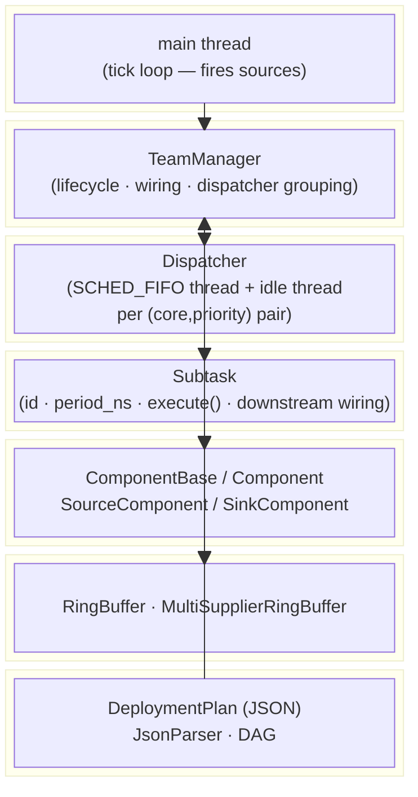
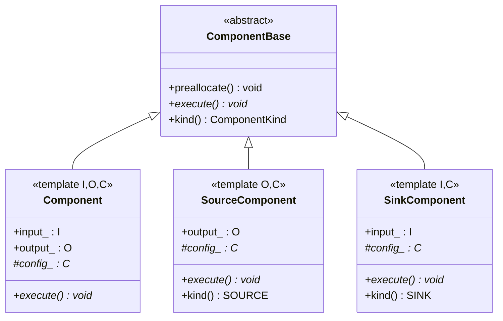
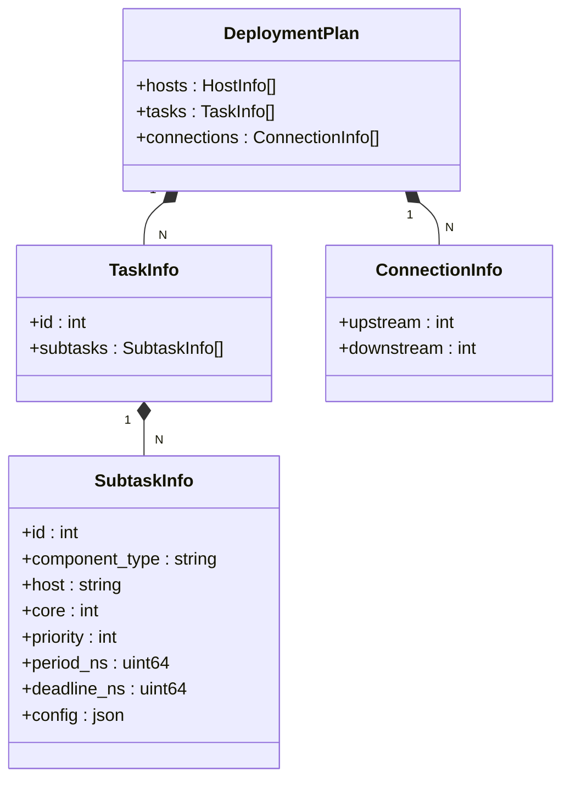
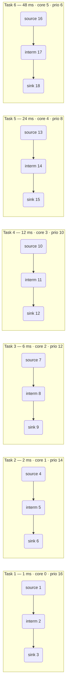
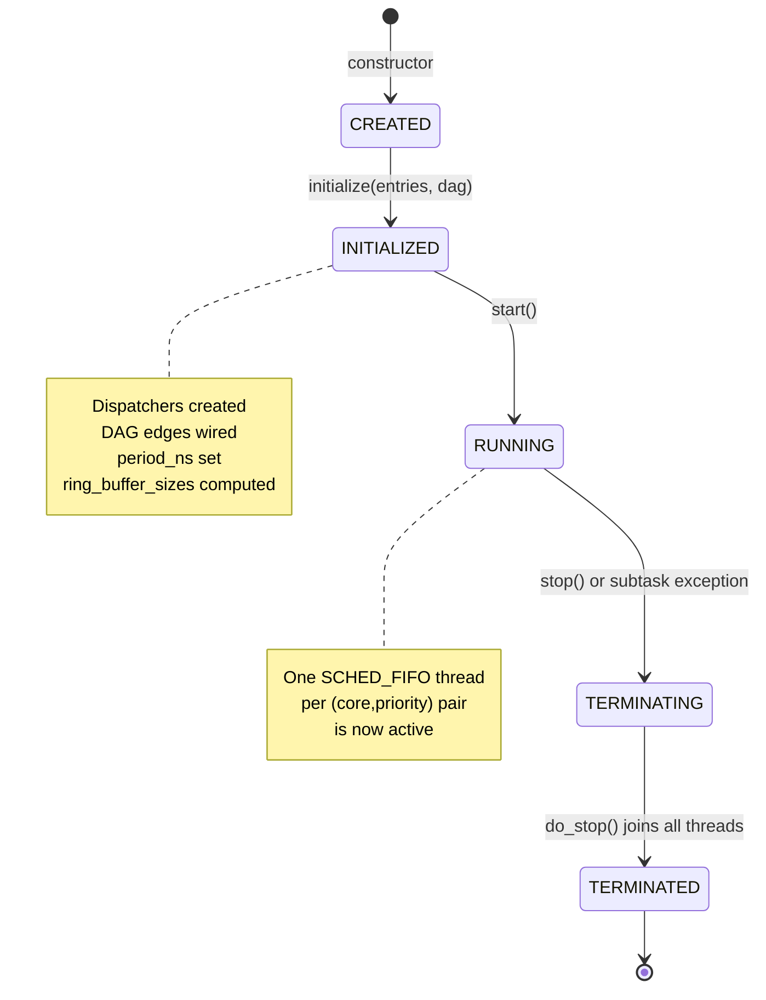
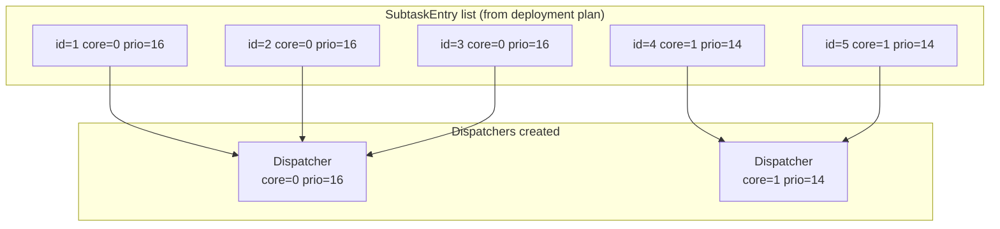
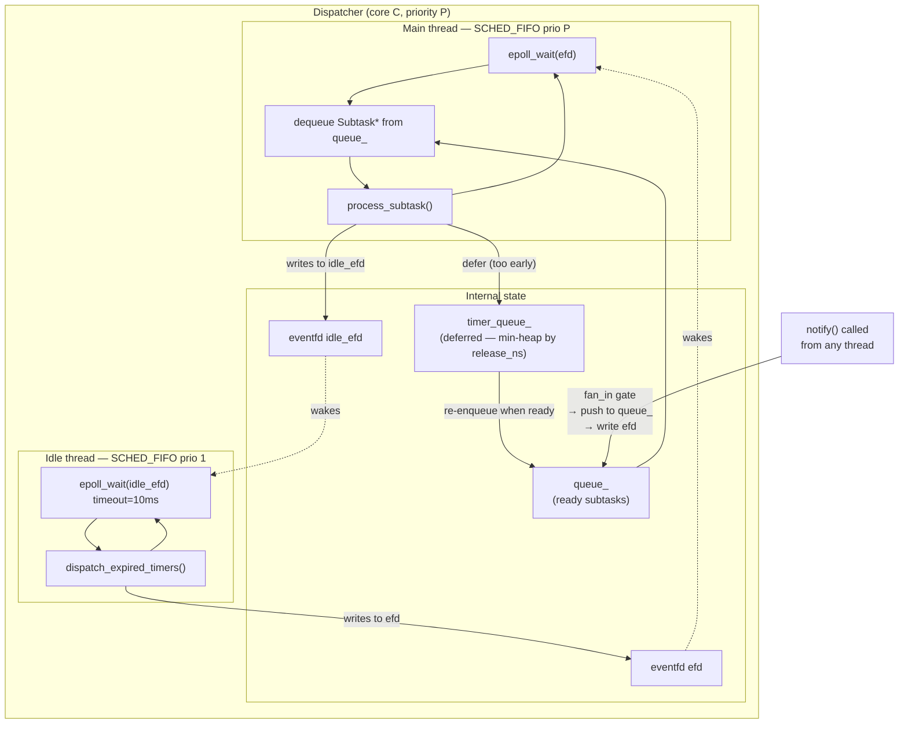
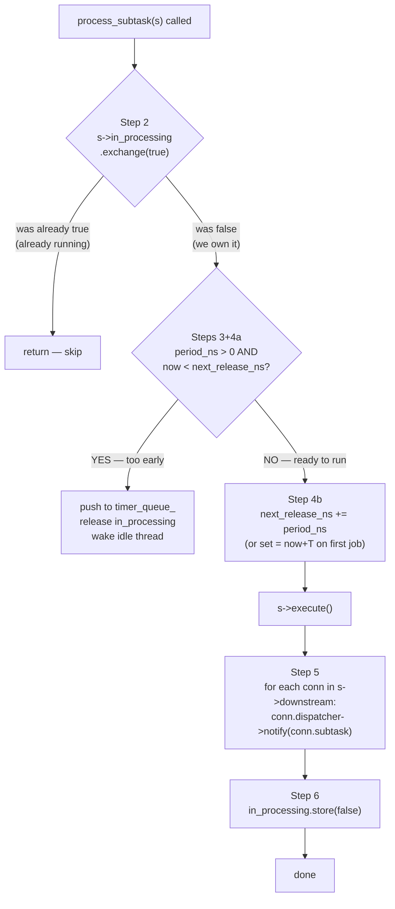
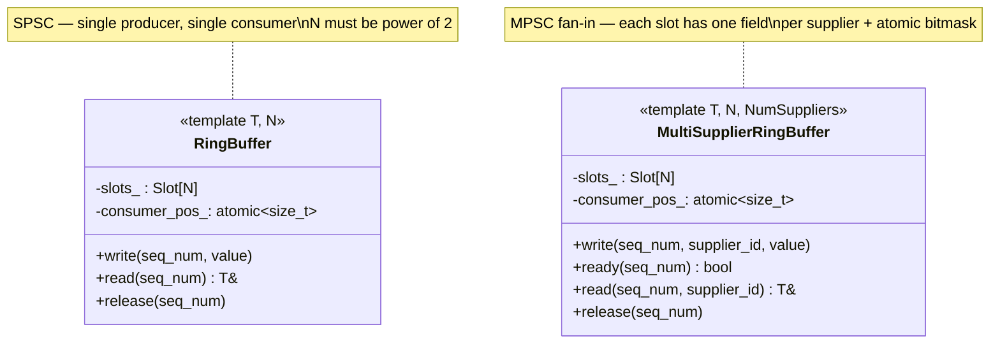
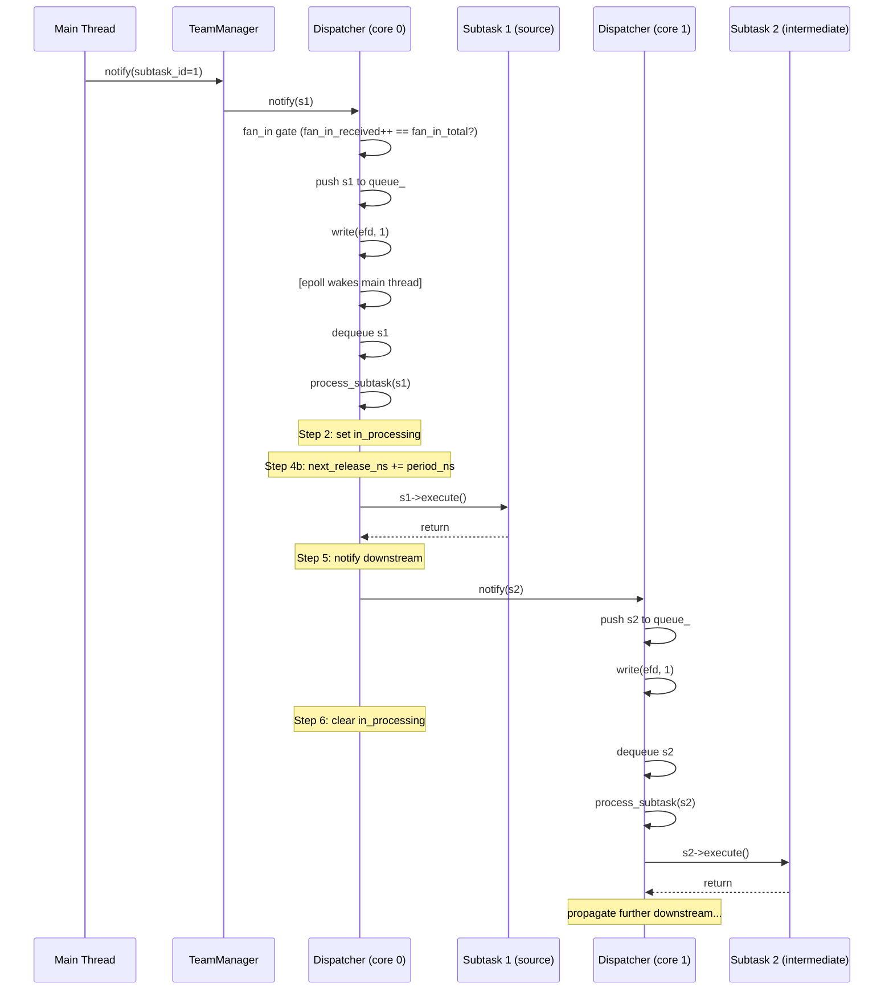

# MCFlow — Architecture Reference

> Based on: Huang et al., *"MCFlow: A Real-Time Streaming Framework for Multi-Core Platforms"*, IEEE RTCSA 2012.

---

## 1. System Overview

MCFlow is a **real-time streaming middleware** for multi-core systems. Its goal is to execute a directed acyclic graph (DAG) of periodic tasks while respecting hard deadlines, minimising scheduling jitter, and avoiding dynamic memory allocation at runtime.

The key design decisions are:

- **Partitioned fixed-priority scheduling** — each subtask is pinned to one CPU core and assigned a POSIX `SCHED_FIFO` priority. Subtasks on the same `(core, priority)` share exactly one dispatcher thread.
- **Lock-free ring buffers** — data flows between subtasks through cache-line-padded, sequence-number-addressed ring buffers to eliminate false sharing and reduce latency.
- **Event-driven dispatch** — dispatchers block on `epoll`/`eventfd` instead of spinning, so idle cores consume no CPU.
- **Static allocation** — all buffers and queues are pre-sized from the deployment plan before `start()` is called.

---

## 2. Layered Architecture



---

## 3. File Map

| File | Layer | Responsibility |
|---|---|---|
| `deployment_plan.hpp` | Configuration | Plain structs: `DeploymentPlan`, `TaskInfo`, `SubtaskInfo`, `ConnectionInfo` |
| `parser_json.hpp/.cpp` | Configuration | Reads JSON into `DeploymentPlan` using nlohmann/json |
| `dag.hpp/.cpp` | Configuration | Directed acyclic graph; topological sort (Kahn); pipeline depth; cycle detection |
| `component.hpp` | Component | Abstract `ComponentBase`; templates `Component<I,O,C>`, `SourceComponent<O,C>`, `SinkComponent<I,C>` |
| `adapter.hpp` | Component | Type-safe `Adapter<Up,Down>` for converting between mismatched output/input types |
| `ring_buffer.hpp` | Data | `RingBuffer<T,N>` (SPSC) and `MultiSupplierRingBuffer<T,N,S>` (fan-in) |
| `dispatcher.hpp` | Scheduling | `Subtask` struct; `Dispatcher` class; 6-step release-guard protocol |
| `team_manager.hpp/.cpp` | Management | Groups subtasks into dispatchers; wires DAG edges; manages lifecycle |

---

## 4. Component Model

Every user-defined processing node inherits from one of these three templates. The templates enforce type safety at compile time through `input_type` / `output_type` aliases.



The `Adapter<Up,Down>` class sits between two components and converts `Up::output_type` into `Down::input_type` using a user-supplied `std::function`. It is instantiated at build time (Phase 6 / codegen) and is not yet wired automatically by `TeamManager`.

---

## 5. Deployment Plan

A `DeploymentPlan` is loaded from JSON and describes the complete graph of tasks. The three core structs map directly to the JSON keys:



### Example: `plans/deployment_plan.json` topology

Six independent pipelines, each with period assigned by Rate-Monotonic Scheduling (shorter period → higher priority):



---

## 6. DAG

`DAG` stores nodes as adjacency lists (`predecessors` + `successors`) and provides three algorithms consumed by `TeamManager::initialize()`:

| Method | Algorithm | Used for |
|---|---|---|
| `topological_sort()` | Kahn's BFS | Dispatcher creation order; ensures sources are started before sinks |
| `pipeline_depth()` | Longest path (DP on topo order) | Ring buffer sizing formula |
| `fan_in_count(id)` | Predecessor list size | Sets `Subtask::fan_in_total` |

---

## 7. TeamManager

`TeamManager` is the single orchestration point. It owns all `Dispatcher` instances and mediates between the application and the scheduling layer.

### 7.1 Lifecycle State Machine



### 7.2 Dispatcher Grouping

The critical rule from paper Section V-B: **one `Dispatcher` per `(core, priority)` pair**, not per subtask. Multiple subtasks on the same core/priority share one thread, one `eventfd`, and one ready queue.



### 7.3 Wiring (done inside `initialize()`)

For every DAG edge `upstream → downstream`, `TeamManager` appends a `SubtaskConn{dispatcher_of_downstream, ptr_to_downstream}` into `upstream->downstream`. After `execute()` finishes, the `Dispatcher` iterates this list and calls `dispatcher->notify(subtask)` for each entry — this is how data-driven activation propagates through the pipeline automatically.

---

## 8. Dispatcher

Each `Dispatcher` owns two POSIX threads pinned to the same CPU core:



### 8.1 The 6-Step Release-Guard Protocol (`process_subtask`)

This is the heart of the real-time scheduling correctness. It prevents double execution and enforces strict periodicity.



**Key invariant exposed by Step 4b:** when `execute()` runs, `s->next_release_ns` already holds the *next* release time. Therefore, inside `execute()`:

```
t_scheduled = s->next_release_ns - s->period_ns   // release of the current job
t_actual    = Dispatcher::monotonic_ns()           // wall clock at execute() entry
latency     = t_actual - t_scheduled
```

---

## 9. Subtask

`Subtask` is the runtime unit of work. It carries both scheduling metadata and the callable:


`Subtask` is **non-copyable** because `std::atomic` members cannot be copied. This requires all `Subtask` objects to be heap-allocated via `std::make_unique` and referred to by raw pointer in lambdas and dispatcher queues.

---

## 10. Ring Buffers

Two ring buffer types handle inter-subtask data flow. Both use cache-line alignment to prevent false sharing.



### Sizing formula (paper Section IV)

```
N = next_power_of_2( max(2,  ceil(deadline_downstream / period_upstream)  +  pipeline_depth) )
```

- `ceil(D/T)` — how many upstream jobs can fire before the downstream deadline; these are "in-flight" simultaneously.
- `pipeline_depth` — worst-case number of stages concurrently holding a buffer slot.
- `next_power_of_2` — required so index wrapping uses a bitmask (`seq & (N-1)`) instead of modulo.

---

## 11. Full Runtime Sequence

From a `notify()` call on the main thread to `execute()` running on a dispatcher thread:



---

## 12. Known Deviations from the Paper

| # | Severity | Description |
|---|---|---|
| 1 | HIGH | Fan-in uses `atomic<int> fan_in_received` instead of `MultiSupplierRingBuffer` indexed by `seq_num`. The counter resets when it reaches `fan_in_total`, which is correct for non-overlapping jobs but loses per-job ordering in deep pipelines with overlapping jobs. |
| 2 | MED | `Adapter` objects exist but are not applied automatically by `TeamManager`. Connections between mismatched types require manual wiring. |
| 3 | LOW | Shutdown uses bulk `stop()` (sinks-first reverse order) rather than a per-subtask cascade as described in Section V-D. |
| 4 | LOW | Single-host only. The paper's Host Manager and network transport layer are not implemented. |
| 5 | INFO | `Dispatcher::subtasks_` + `register_subtask()` are populated but never read. Dead code. |
| 6 | INFO | `Demultiplexer::all_suppliers_ready()` is defined but never called. Dead code. |
