# MCFlow — Architecture Reference

> Based on: Huang et al., *"MCFlow: A Real-Time Streaming Framework for Multi-Core Platforms"*, IEEE RTCSA 2012.

---

## Table of Contents

1. [System Overview](#1-system-overview)
2. [Layered Architecture](#2-layered-architecture)
3. [File Map](#3-file-map)
4. [Configuration Layer — Deployment Plan & JSON Parser](#4-configuration-layer--deployment-plan--json-parser)
5. [DAG — Directed Acyclic Graph](#5-dag--directed-acyclic-graph)
6. [Component Model](#6-component-model)
7. [Adapter — Type Conversion Between Components](#7-adapter--type-conversion-between-components)
8. [Subtask — Runtime Unit of Work](#8-subtask--runtime-unit-of-work)
9. [Ring Buffers — Inter-Subtask Communication](#9-ring-buffers--inter-subtask-communication)
10. [Dispatcher — Scheduling Engine](#10-dispatcher--scheduling-engine)
11. [TeamManager — Orchestration Layer](#11-teammanager--orchestration-layer)
12. [Scheduling Model](#12-scheduling-model)
13. [Full Runtime Execution Flow](#13-full-runtime-execution-flow)
14. [Startup and Shutdown Sequence](#14-startup-and-shutdown-sequence)
15. [Known Deviations from the Paper](#15-known-deviations-from-the-paper)

---

## 1. System Overview

MCFlow is a **real-time streaming middleware** for multi-core systems. It solves a concrete problem in industrial and embedded computing: how to execute a fixed graph of interdependent, periodic processing tasks on a multi-core processor such that:

- every task meets its **hard deadline** every period,
- **scheduling jitter** (variation in actual start time) is minimised,
- **no dynamic memory allocation** happens during steady-state execution (all buffers are pre-sized at startup),
- **data races** between producer and consumer threads are impossible by construction.

The system models work as a **Directed Acyclic Graph (DAG)** of subtasks. Data flows from source nodes (sensors, generators) through intermediate processing stages to sink nodes (actuators, displays, loggers). Each subtask runs on a fixed CPU core at a fixed POSIX real-time priority. Cores never steal work from each other.

### Core Design Decisions

| Decision | Mechanism | Why |
|---|---|---|
| Partitioned fixed-priority scheduling | `SCHED_FIFO` + `pthread_setaffinity_np` | Predictable, no migration overhead, standard RMS analysis applies |
| Event-driven dispatch | Linux `epoll` + `eventfd` | Dispatcher thread sleeps when idle; no busy-wait CPU waste |
| Lock-free data transfer | Cache-line-padded ring buffers | Eliminates false sharing; avoids mutex in the data path |
| Static memory | `reserve()` + compile-time `N` in `RingBuffer<T,N>` | No heap allocation during RT execution; no unpredictable `malloc` latency |
| One thread per `(core, priority)` | `TeamManager` dispatcher grouping | Matches the partitioned scheduling model; avoids unnecessary threads |

---

## 2. Layered Architecture

The system is organised in seven layers. Higher layers depend on lower ones; no upward dependency exists.

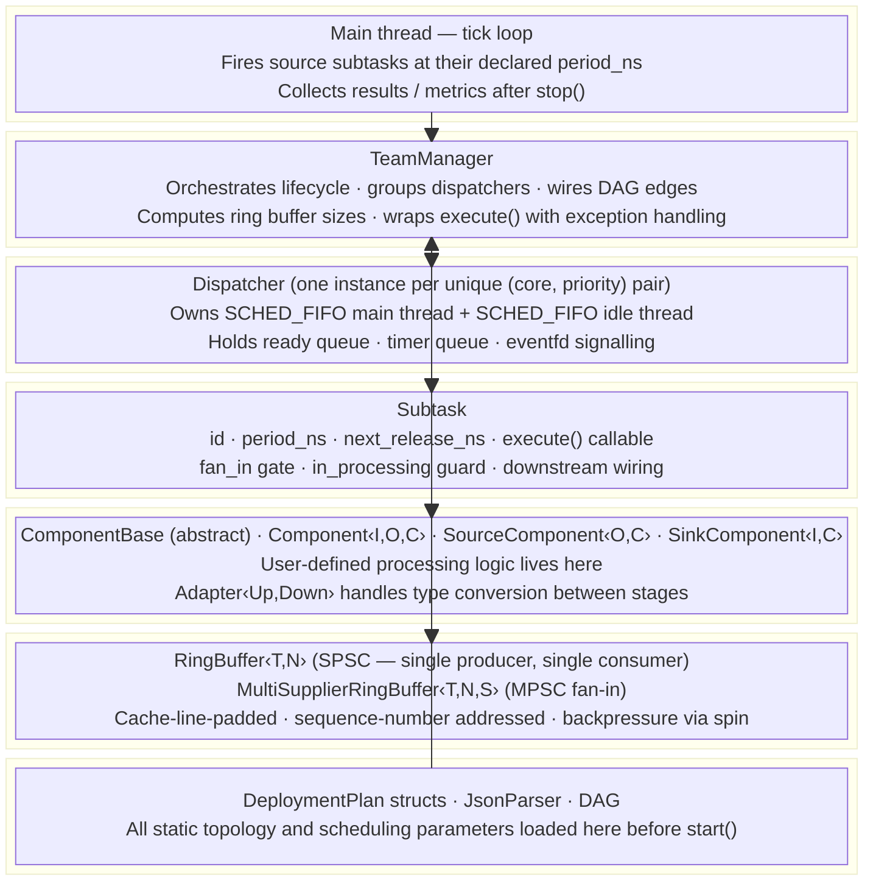

Data flows **downward** at startup (configuration instantiates scheduling objects) and **sideways** at runtime (ring buffers carry data between subtasks on different cores).

---

## 3. File Map

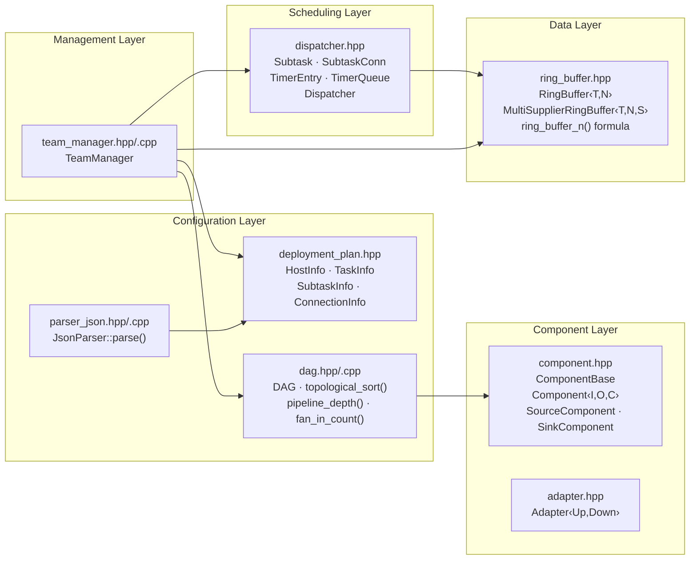

---

## 4. Configuration Layer — Deployment Plan & JSON Parser

### 4.1 Struct Hierarchy

The deployment plan describes the **complete static topology** of the system. It is the single source of truth for all scheduling parameters.

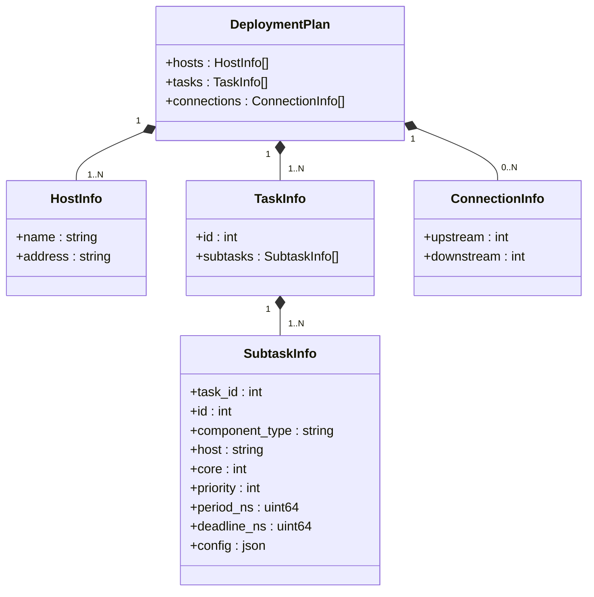

**Key field semantics:**

| Field | Type | Meaning |
|---|---|---|
| `id` (subtask) | `int` | Globally unique identifier across all tasks. Used as array index in ring buffers and metric maps. |
| `component_type` | `string` | One of `"source"`, `"intermediate"`, `"sink"`. Determines how `TeamManager` assigns `fan_in_total`. |
| `core` | `int` | CPU core index (0-based). The dispatcher thread is pinned here via `pthread_setaffinity_np`. |
| `priority` | `int` | POSIX real-time priority (1–99). Applied via `pthread_setschedparam(SCHED_FIFO)`. |
| `period_ns` | `uint64_t` | Activation period in nanoseconds. Stored in `Subtask::period_ns`. Zero means aperiodic. |
| `deadline_ns` | `uint64_t` | Hard deadline relative to release time. Used only for ring buffer sizing; not enforced at runtime. |
| `config` | `json` | Arbitrary component-specific configuration (thresholds, filter coefficients, etc.). Passed to the component constructor. |

### 4.2 JsonParser

`JsonParser::parse(filename)` opens the file, deserialises it with **nlohmann/json**, and builds a `DeploymentPlan` by calling three private helpers:

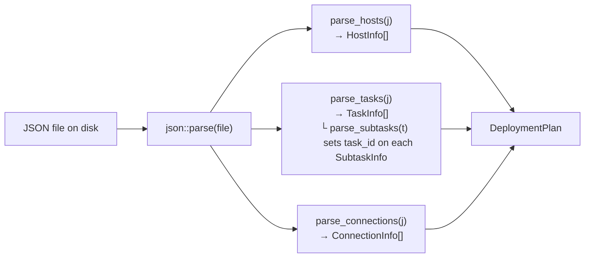

All fields use `s.value("key", default)` so missing optional fields (e.g. `host`, `config`) do not throw.

### 4.3 Example — `deployment_plan.json` topology

Six independent pipelines. Priority is assigned by **Rate-Monotonic Scheduling**: shorter period → higher priority.

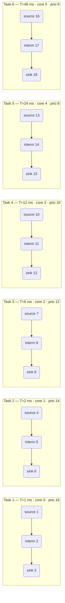

Each task has exactly one source, one intermediate, and one sink subtask — a linear pipeline of depth 3. Each pipeline runs fully isolated on its own core with its own dispatcher.

---

## 5. DAG — Directed Acyclic Graph

`DAG` is a pure data structure that stores the dependency graph and provides three graph algorithms consumed by `TeamManager::initialize()`. It uses an **adjacency list** representation: each node stores both its `predecessors` and `successors` for O(1) neighbour access.

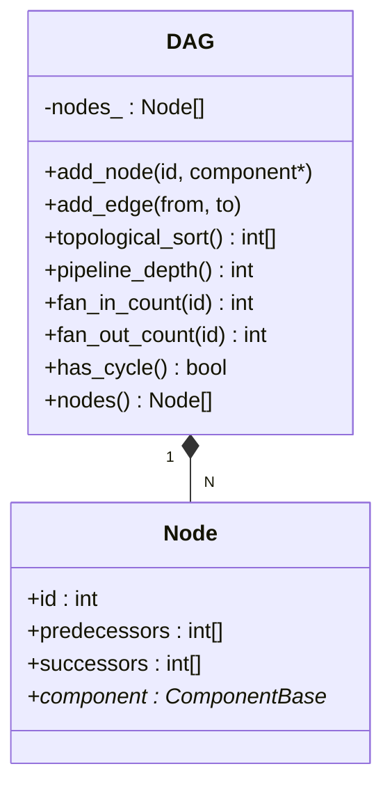

### 5.1 Algorithms

**`topological_sort()` — Kahn's BFS algorithm**

Produces a linear ordering of all nodes such that every predecessor appears before its successors. `TeamManager` uses this order to:
- Create dispatchers in source-to-sink order (so sources are ready before sinks start receiving notifications).
- Validate that every DAG node has a corresponding `SubtaskEntry`.

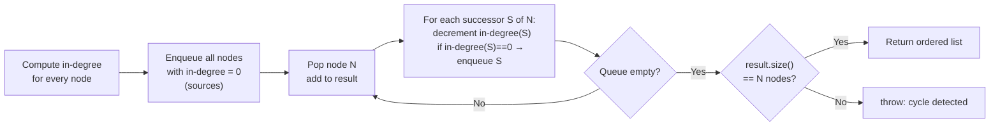

**`pipeline_depth()` — Longest Path**

Computes the length of the longest chain of nodes from any source to any sink using **dynamic programming on the topological order**. This is the critical input to the ring buffer sizing formula — it represents the worst-case number of stages that simultaneously hold a buffer slot.

**`fan_in_count(id)` — Predecessor count**

Returns `node.predecessors.size()`. `TeamManager` sets `Subtask::fan_in_total` from this value. A source node has `fan_in_count == 0`; `TeamManager` clamps this to 1 so the first external `notify()` always fires it.

---

## 6. Component Model

The component model defines the user-facing API for writing processing logic. Every processing node in the pipeline inherits from one of three templates.

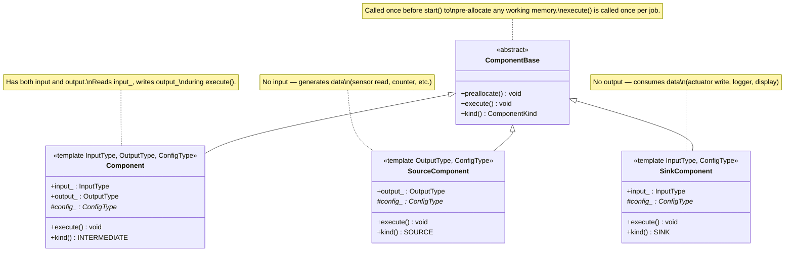

### 6.1 How a Component Integrates with the Runtime

The component's logic lives inside `execute()`. However, **the component object itself is never called directly by the dispatcher**. Instead, `TeamManager` (or user code in `example_from_plan.cpp`) wraps the component call inside a `std::function<void()>` lambda that is stored in `Subtask::execute`. This indirection allows:

- Capturing ring buffer pointers and sequence number state in the closure.
- Injecting instrumentation (latency measurement, exception handling) without modifying the component class.
- Deferring the connection between component I/O fields and ring buffer slots until `initialize()` time.

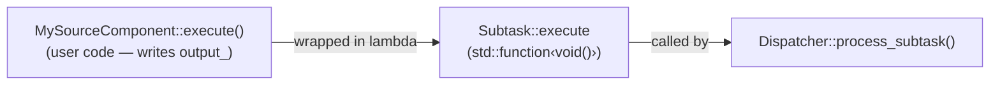

### 6.2 `preallocate()`

Called once during the initialization phase, before any RT thread starts. Subclasses override this to pre-allocate working buffers (e.g. `std::vector::reserve`, FFT plans) so that no heap allocation occurs during `execute()`.

### 6.3 `ComponentKind`

The `kind()` method returns an enum (`SOURCE`, `INTERMEDIATE`, `SINK`). This is used to infer the pipeline role at build time and by future code-generation tooling. At runtime, the kind is implicit in the wiring (no predecessors → source; no successors → sink).

---

## 7. Adapter — Type Conversion Between Components

When an upstream component produces a type `A` and a downstream component expects type `B`, an `Adapter<Up, Down>` bridges the gap.

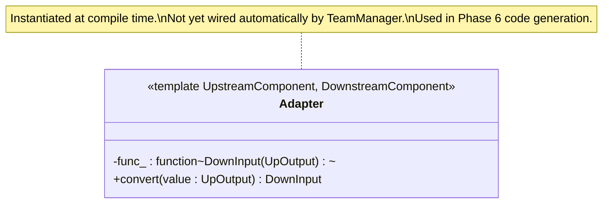

The adapter wraps a user-supplied `std::function` (which can be a lambda capturing context). Its `convert()` method is called by generated code in the lambda that connects two subtask buffers.

**Current status:** `adapter.hpp` is implemented but `TeamManager` does not wire adapters automatically. Connections between components of mismatched types require hand-written glue code or the Phase 6 code generator.

---

## 8. Subtask — Runtime Unit of Work

`Subtask` is the central struct of the scheduling layer. One `Subtask` exists per subtask node in the deployment plan.

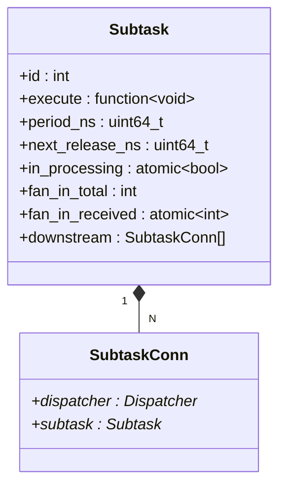

### 8.1 Field-by-Field Explanation

**`id`** — Matches `SubtaskInfo::id` from the deployment plan. Used as the key in `TeamManager`'s maps and as an array index in ring buffer and metrics arrays.

**`execute`** — A `std::function<void()>` holding the closure that runs the actual computation. Set during build time (user code) and then wrapped by `TeamManager::initialize()` with exception handling. The dispatcher calls this exactly once per job.

**`period_ns`** — The activation period in nanoseconds. Set from `SubtaskInfo::period_ns` by `TeamManager`. The dispatcher uses this to compute `next_release_ns` and to defer premature activations to the timer queue.

**`next_release_ns`** — The absolute CLOCK_MONOTONIC time of the *next* permitted execution. Starts at 0 (meaning: execute immediately on the first activation). After the first job: `next_release_ns = now + period_ns`. After each subsequent job: `next_release_ns += period_ns`. This strictly periodic advancement prevents drift — the period is never "stretched" by execution time.

**`in_processing`** — An atomic boolean that acts as a **mutex-free re-entrancy guard**. Set to `true` before `execute()` is called; cleared to `false` after all downstream notifications are sent. If a second notification arrives while the subtask is still executing (possible in fan-in scenarios), the second `process_subtask()` call returns immediately without double-executing.

**`fan_in_total`** — How many upstream suppliers must deliver a notification before this subtask is eligible to run. Set by `TeamManager` from `DAG::fan_in_count()`. For a source, this is always 1 (the external `notify()` call acts as the single supplier).

**`fan_in_received`** — An atomic counter that `Dispatcher::notify()` increments for each incoming notification. When `fan_in_received == fan_in_total`, the subtask is enqueued and the counter is reset to 0 for the next job. **Note:** this counter is shared across all suppliers, which is correct only for non-overlapping jobs. See Section 15 for the known limitation.

**`downstream`** — A list of `SubtaskConn` pairs, each holding a pointer to a downstream subtask and its owning dispatcher. After `execute()` returns, the dispatcher iterates this list and calls `conn.dispatcher->notify(conn.subtask)` for each entry. This is how data-driven activation propagates through the pipeline without any manual wiring in user code.

### 8.2 Why Subtask is Non-Copyable

`Subtask` has two `std::atomic` members (`in_processing`, `fan_in_received`). Atomics are **not copyable** in C++ because copying atomic state would create a race condition window. This means:

- `Subtask` objects must live on the heap (allocated with `std::make_unique`).
- All references to a `Subtask` are raw pointers (`Subtask*`), never copies.
- Lambdas that need to read `period_ns` or `next_release_ns` at runtime must capture a `Subtask*` pointer (not a copy of the struct).

This leads to the **two-phase construction pattern** used throughout the examples:

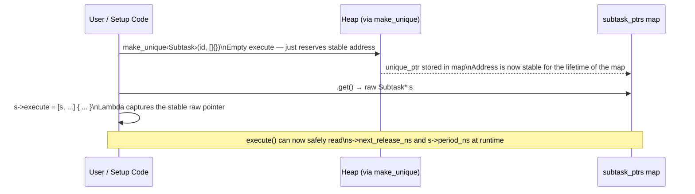

---

## 9. Ring Buffers — Inter-Subtask Communication

Two ring buffer templates in `ring_buffer.hpp` handle all data passing between subtask stages. Both use **sequence-number addressing** instead of head/tail pointers, which simplifies multi-supplier coordination.

### 9.1 RingBuffer\<T, N\> — SPSC

Single-producer, single-consumer. Used for every 1-to-1 edge in the DAG.

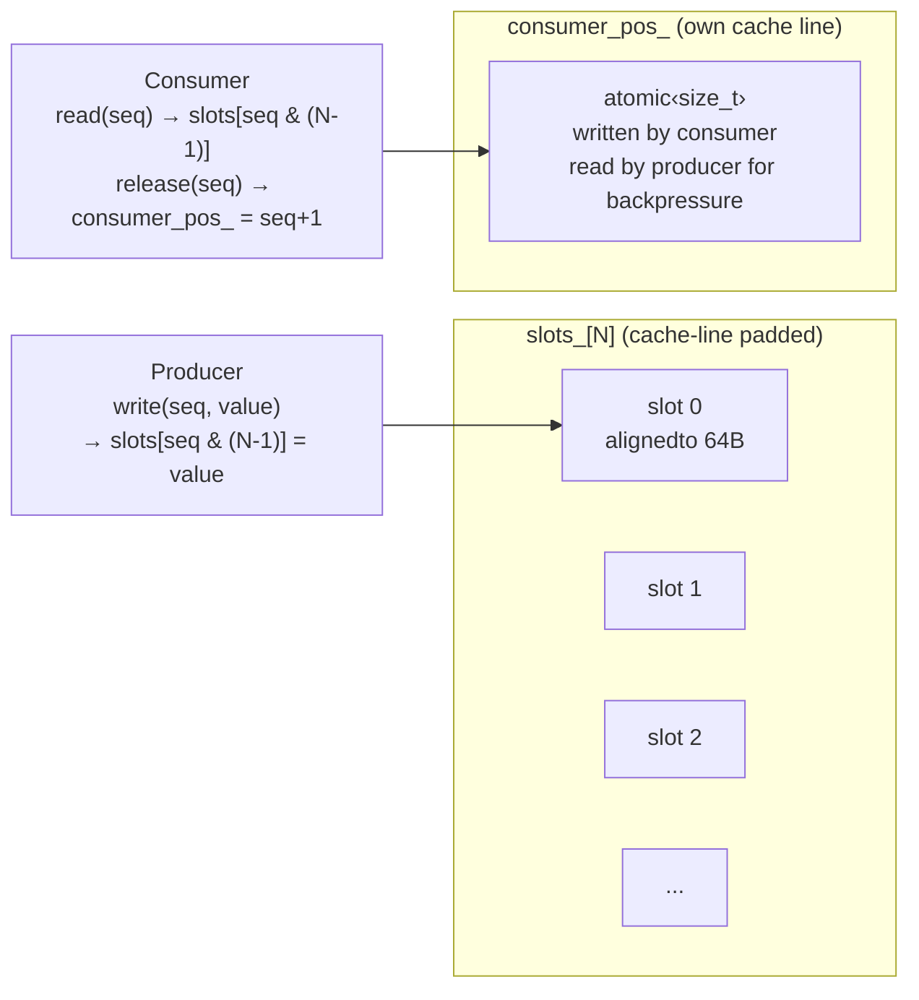

**`write(seq_num, value)`** — First spins until `seq_num < consumer_pos_ + N` (backpressure: producer must wait if the ring is full). Then writes the value into `slots[seq_num & (N-1)]`. The modular index `& (N-1)` works only because N is a power of 2.

**`read(seq_num)`** — Returns a reference to the slot. Valid until `release()` is called. No lock needed because the sequence number guarantees the slot belongs to this job.

**`release(seq_num)`** — Advances `consumer_pos_` to `seq_num + 1`, freeing the slot for the producer to reuse `N` jobs later.

**Cache-line padding:** Each `Slot` is `alignas(64)` and its size is rounded up to a multiple of 64 bytes. The `consumer_pos_` lives on its own cache line. This eliminates false sharing between a producer on core 0 writing a slot and a consumer on core 1 reading an adjacent slot.

### 9.2 MultiSupplierRingBuffer\<T, N, NumSuppliers\> — MPSC Fan-In

Multiple producers, single consumer. Used when a subtask has more than one upstream supplier (fan-in).

Each slot stores one data field **per supplier** plus an atomic **bitmask** that tracks which suppliers have written for this job. The consumer can only read the slot after all `NumSuppliers` bits are set.

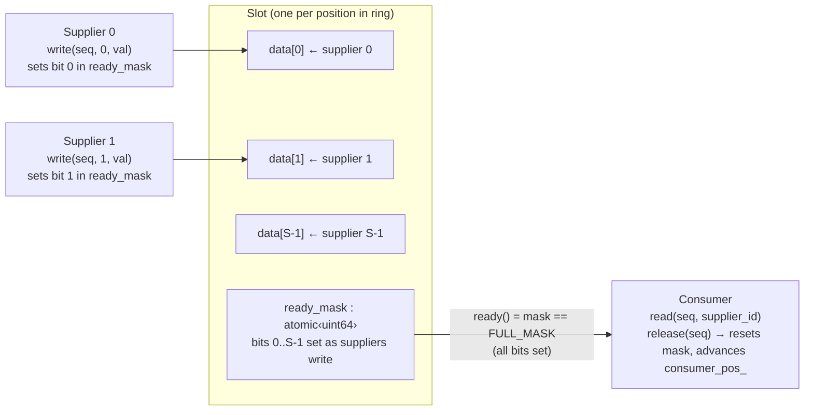

### 9.3 Buffer Sizing Formula

The compile-time template parameter `N` must be large enough to prevent the producer from spinning (backpressure) under normal operating conditions. The formula from paper Section IV:

```
N = next_power_of_2( max(2,  ⌈deadline_downstream / period_upstream⌉  +  pipeline_depth) )
```

| Term | Explanation |
|---|---|
| `⌈D/T⌉` | How many upstream jobs can be released before the downstream deadline expires. These are simultaneously "in-flight" in the buffer. |
| `pipeline_depth` | Longest chain of stages in the entire DAG. Each stage in the chain holds one buffer slot at a time in the worst case. |
| `max(2, ...)` | Minimum of 2 ensures double-buffering: producer can always be one job ahead of the consumer. |
| `next_power_of_2` | Required for the `seq & (N-1)` index trick. Also aligns to cache boundaries. |

`TeamManager::ring_buffer_size(up_id, down_id)` returns the pre-computed `N` for each edge. This value is used at code-generation time (Phase 6) to instantiate `RingBuffer<T, N>` with the correct compile-time size.

---

## 10. Dispatcher — Scheduling Engine

Each `Dispatcher` is the real-time execution engine for one `(core, priority)` class. It owns exactly **two POSIX threads** pinned to the same CPU core.

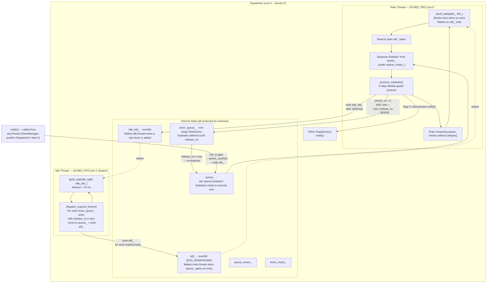

### 10.1 Main Thread Loop

The main thread runs at the configured `SCHED_FIFO` priority. It:

1. **Blocks** on `epoll_wait` until a token appears on `efd_`. Blocking instead of spinning means the OS can schedule other threads on the core while no work is pending.
2. **Reads** the `eventfd` token (consuming one unit from the semaphore).
3. **Dequeues** one `Subtask*` from `queue_` under `queue_mutex_`.
4. Calls **`process_subtask(s)`** (the 6-step protocol — see Section 10.3).
5. **Drains** the remaining queue without going back to `epoll_wait`, to avoid the syscall overhead when multiple subtasks are already ready.

### 10.2 Idle Thread

The idle thread runs at `SCHED_FIFO` priority 1 (the lowest real-time priority) on the **same core** as the main thread. Because the main thread has a higher priority, the OS pre-empts the idle thread the moment the main thread wakes up — the idle thread only runs when the core is truly idle.

Its sole job is to **drain the timer queue**: poll for `TimerEntry` objects whose `release_ns ≤ now`, move them back to `queue_`, and write `efd_` to wake the main thread. This implements *early release* — a subtask deferred from one job cycle gets re-evaluated as soon as the core is free.

The idle thread uses a 10 ms `epoll_wait` timeout as a fallback to catch timers that expire without a new `idle_efd_` write (a race between timer expiry and the signal).

### 10.3 The 6-Step Release-Guard Protocol

This protocol is the correctness core of the dispatcher. It is implemented in `process_subtask()` and guarantees:
- A subtask executes **at most once at a time** (re-entrancy guard).
- A subtask never executes **before its release time** (periodic correctness).
- `next_release_ns` advances by exactly one period per job regardless of actual execution time (drift prevention).

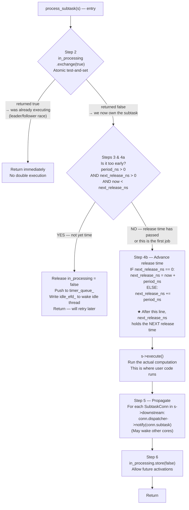

**The Step 4b invariant** is the key insight that makes latency measurement possible: when `execute()` runs, `next_release_ns` already holds the *next* period's release time. Subtracting `period_ns` recovers the *current* job's scheduled start time:

```
t_scheduled = s->next_release_ns - s->period_ns
t_actual    = Dispatcher::monotonic_ns()   (captured at entry of execute())
latency     = t_actual - t_scheduled       (positive = started late)
```

### 10.4 Fan-In Gate Inside `notify()`

Before enqueuing a subtask, `notify()` implements the fan-in condition:

```cpp
int received = s->fan_in_received.fetch_add(1) + 1;
if (received < s->fan_in_total) return;   // still waiting for more suppliers
s->fan_in_received.store(0);              // reset for the next job
// ... enqueue s and write efd_
```

This ensures that a subtask with `fan_in_total = 2` only runs after **both** upstream suppliers have delivered a notification for the current job.

### 10.5 `eventfd` and `epoll` — Why Not a Mutex/Condition Variable?

| Mechanism | Latency | Behaviour |
|---|---|---|
| `pthread_cond_wait` | ~1–5 µs | Fair wake, but involves futex + scheduler |
| `eventfd` + `epoll_wait` | ~0.5–2 µs | Single syscall, integrates with Linux I/O event loop |

`eventfd(0, EFD_SEMAPHORE)` creates a counter that `write(fd, 1)` increments and `read(fd)` decrements. With `EFD_SEMAPHORE`, each `read` only consumes one token, so if 3 subtasks are pushed before `epoll_wait` wakes, the loop processes all three via the drain step (Section 10.1, step 5).

---

## 11. TeamManager — Orchestration Layer

`TeamManager` is the single object that an application interacts with. It owns all `Dispatcher` instances, performs all wiring, and enforces the lifecycle state machine.

### 11.1 Lifecycle State Machine

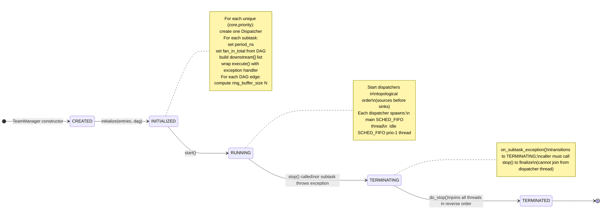

### 11.2 `initialize()` — Step by Step

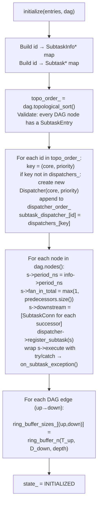

### 11.3 Dispatcher Grouping — The Partitioned Scheduling Rule

The paper (Section V-B) mandates that subtasks are assigned to dispatcher threads by their `(core, priority)` pair, not one thread per subtask. This models **partitioned fixed-priority scheduling**: at any moment, only the highest-priority ready subtask on each core runs.

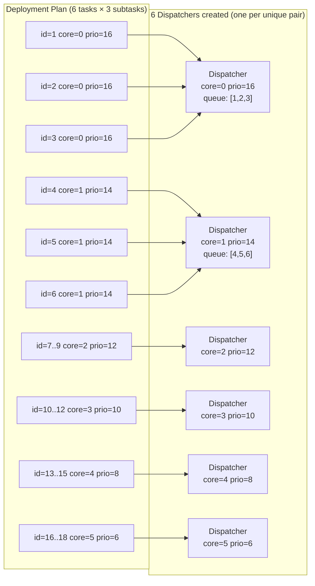

### 11.4 Downstream Wiring

After `execute()` returns, the dispatcher automatically notifies all downstream subtasks by iterating `s->downstream`. This list is built by `TeamManager` during `initialize()` from the DAG's successor edges. No manual notification code is needed in user `execute()` functions.

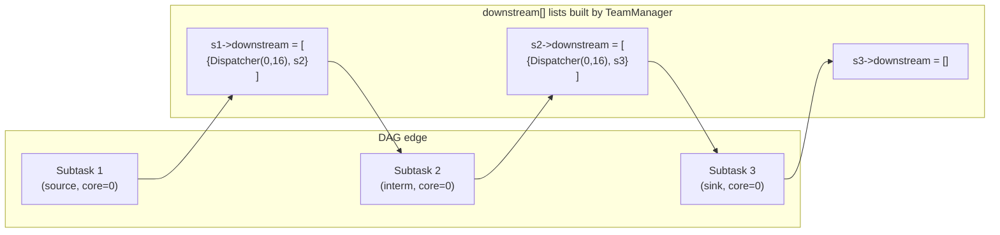

### 11.5 Exception Handling Wrapper

`TeamManager` wraps every `execute()` with a try/catch block. If a subtask throws, `on_subtask_exception()` is called on the main thread to transition the system to `TERMINATING`. The dispatcher thread itself is never stopped from within (doing so would deadlock on `pthread_join`). The application's main thread must detect the state change and call `stop()`.

### 11.6 Shutdown — Reverse Topological Order

`do_stop()` stops dispatchers in **reverse** `dispatcher_order_` (the order they were created in topo sort, i.e., source-to-sink). Stopping in reverse means sinks stop first: they will no longer accept notifications. Then intermediate stages stop, then sources. This prevents a race where a source fires a notification at an already-stopped sink-side dispatcher.

---

## 12. Scheduling Model

### 12.1 Rate-Monotonic Scheduling (RMS)

The deployment plan assigns priorities using the **Rate-Monotonic** rule: the subtask with the shorter period gets the higher POSIX priority. This is optimal for fixed-priority preemptive scheduling of independent periodic tasks under the condition:

```
U = Σ (C_i / T_i)  ≤  n × (2^(1/n) − 1)
```

where `C_i` is worst-case execution time, `T_i` is period, and `n` is the number of tasks.

### 12.2 SCHED_FIFO and Core Affinity

Each dispatcher applies:

```cpp
// Core pinning
pthread_setaffinity_np(pthread_self(), sizeof(mask), &mask);

// RT priority
struct sched_param param{ .sched_priority = priority_ };
pthread_setschedparam(pthread_self(), SCHED_FIFO, &param);
```

`SCHED_FIFO` is a non-preemptive RT policy within the same priority level: a running thread is only pre-empted by a **higher-priority** thread on the same core, never by a same-priority thread. Combined with the single-thread-per-`(core,priority)` model, this guarantees the intended scheduling behaviour.

Requires `CAP_SYS_NICE` (running as root or with `sudo`). Without it, the dispatcher warns and falls back to the default `SCHED_OTHER` policy, which introduces the high jitter seen in non-privileged measurements.

### 12.3 Clock Source

All timestamps use `CLOCK_MONOTONIC` via:

```cpp
static uint64_t Dispatcher::monotonic_ns() {
    struct timespec ts;
    clock_gettime(CLOCK_MONOTONIC, &ts);
    return ts.tv_sec * 1e9 + ts.tv_nsec;
}
```

`CLOCK_MONOTONIC` never goes backwards and is not affected by NTP adjustments, making it safe for deadline arithmetic.

---

## 13. Full Runtime Execution Flow

From a single `notify()` call on the main thread to the sink's `execute()` completing:

```mermaid
sequenceDiagram
    participant App  as Application\n(tick loop)
    participant TM   as TeamManager
    participant D0   as Dispatcher\n(core 0, prio 16)
    participant Sub1 as Subtask 1\n(source)
    participant Sub2 as Subtask 2\n(intermediate)
    participant Sub3 as Subtask 3\n(sink)

    App->>TM: notify(id=1)
    TM->>D0: dispatcher->notify(s1)

    Note over D0: fan_in gate:\nfan_in_received++ == fan_in_total (1)\n→ enqueue s1, write efd_

    D0->>D0: epoll_wait returns
    D0->>D0: dequeue s1
    D0->>D0: process_subtask(s1)

    Note over D0: Step 2: in_processing.exchange(true)
    Note over D0: Steps 3+4a: now >= next_release_ns ✓
    Note over D0: Step 4b: next_release_ns += period_ns

    D0->>Sub1: s1->execute()\n(sensor read / counter increment)
    Sub1-->>D0: return

    Note over D0: Step 5: notify downstream\nconn = {D0, s2}
    D0->>D0: D0.notify(s2) → enqueue s2, write efd_

    Note over D0: Step 6: in_processing = false

    D0->>D0: dequeue s2  (drain loop)
    D0->>D0: process_subtask(s2)
    D0->>Sub2: s2->execute()\n(processing — reads RingBuffer from s1)
    Sub2-->>D0: return

    Note over D0: Step 5: notify downstream\nconn = {D0, s3}
    D0->>D0: D0.notify(s3) → enqueue s3

    D0->>D0: dequeue s3
    D0->>D0: process_subtask(s3)
    D0->>Sub3: s3->execute()\n(actuator / logger)
    Sub3-->>D0: return

    Note over D0: No further downstream → chain complete
```

Because all three subtasks in this example share `(core=0, priority=16)`, they all run in the same dispatcher's drain loop — no cross-core notification is needed, minimising latency.

---

## 14. Startup and Shutdown Sequence

```mermaid
sequenceDiagram
    participant App as Application
    participant TM  as TeamManager
    participant DX  as Dispatcher (×N)
    participant OS  as Linux Kernel

    App->>App: JsonParser::parse(filename)\n→ DeploymentPlan

    App->>App: Build DAG\n(add_node, add_edge for each subtask/connection)

    App->>App: Create Subtask objects\n(make_unique, assign execute lambdas)

    App->>TM: initialize(entries, dag)
    TM->>TM: Group subtasks by (core, priority)\nCreate Dispatchers\nWire downstream[] lists\nSet period_ns, fan_in_total\nCompute ring_buffer_sizes

    App->>TM: start()
    TM->>DX: dispatcher->start()  (for each, in topo order)
    DX->>OS: pthread_create(main thread + idle thread)
    DX->>OS: epoll_create, eventfd
    DX->>OS: pthread_setaffinity_np\npthread_setschedparam(SCHED_FIFO)

    loop Every min_period tick
        App->>TM: notify(source_id)  (for sources whose period has elapsed)
        TM->>DX: dispatcher->notify(source_subtask)
        Note over DX: Chain propagates automatically\nthrough downstream[] wiring
    end

    App->>TM: stop()
    TM->>DX: dispatcher->stop()  (in reverse topo order: sinks first)
    DX->>OS: write(efd_, wake_token)
    DX->>OS: pthread_join(main thread)\npthread_join(idle thread)
    DX->>OS: close(efd_, epfd_, idle_efd_)
    TM->>TM: state_ = TERMINATED
```

---

## 15. Known Deviations from the Paper

| # | Severity | Location | Description | Impact |
|---|---|---|---|---|
| 1 | **HIGH** | `dispatcher.hpp:111` | Fan-in uses `atomic<int> fan_in_received` instead of `MultiSupplierRingBuffer` indexed by `seq_num`. The counter resets globally when it reaches `fan_in_total`, so two consecutive jobs can interfere if the first job's second supplier is late and the second job's first supplier is early. | Possible incorrect execution order in overlapping fan-in pipelines. |
| 2 | **MED** | `adapter.hpp`, `team_manager.cpp` | `Adapter<Up,Down>` is implemented but `TeamManager::initialize()` never instantiates or wires adapters. Type conversion between mismatched component types requires hand-written lambda glue. | Components with different I/O types cannot be connected without manual code. |
| 3 | **LOW** | `team_manager.cpp:186` | Shutdown stops dispatchers in bulk reverse order, not per-subtask cascade as described in paper Section V-D. | Slightly less graceful drain of in-flight jobs at shutdown; no data loss in practice. |
| 4 | **LOW** | Global | Single-host only. `HostInfo::address` is parsed but never used. The Host Manager and network transport layer from Section V-A are absent. | Cannot run tasks on remote nodes. |
| 5 | **INFO** | `dispatcher.hpp:101,339` | `Dispatcher::subtasks_` (a `std::vector<Subtask*>`) is populated by `register_subtask()` but never read anywhere. Dead code. | No functional impact; wasted memory. |
| 6 | **INFO** | `dispatcher.hpp` (Demultiplexer) | `Demultiplexer::all_suppliers_ready()` is defined but never called. Dead code. | No functional impact. |
