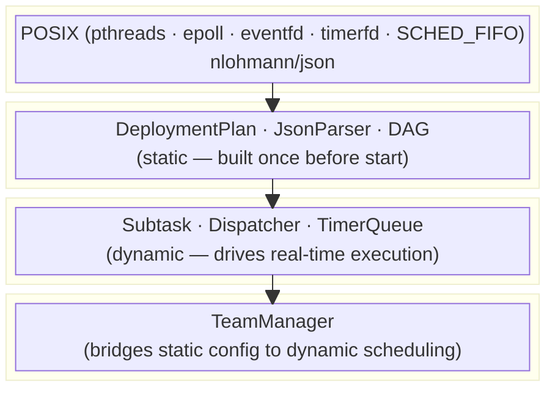
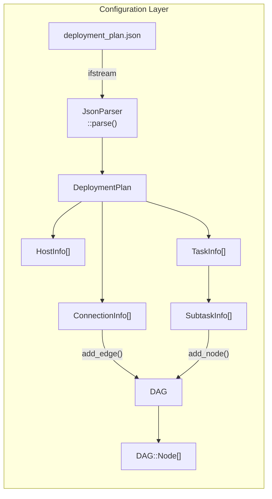
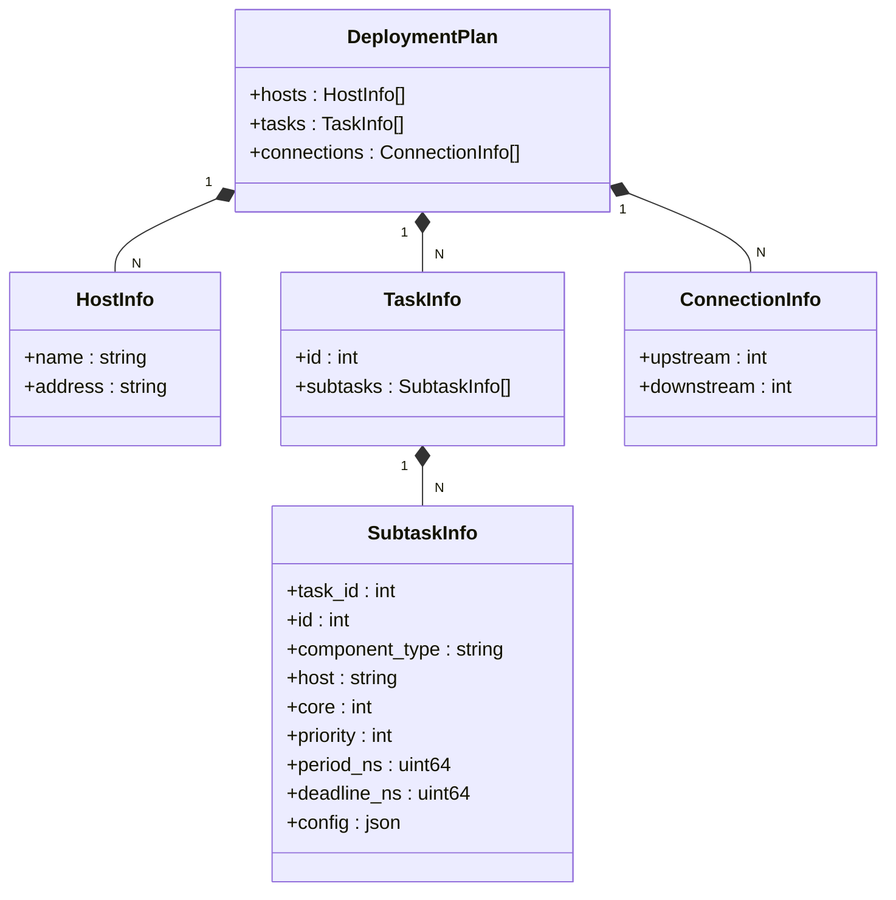
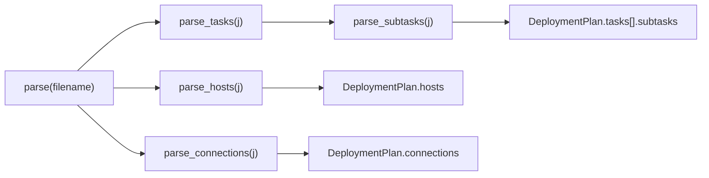
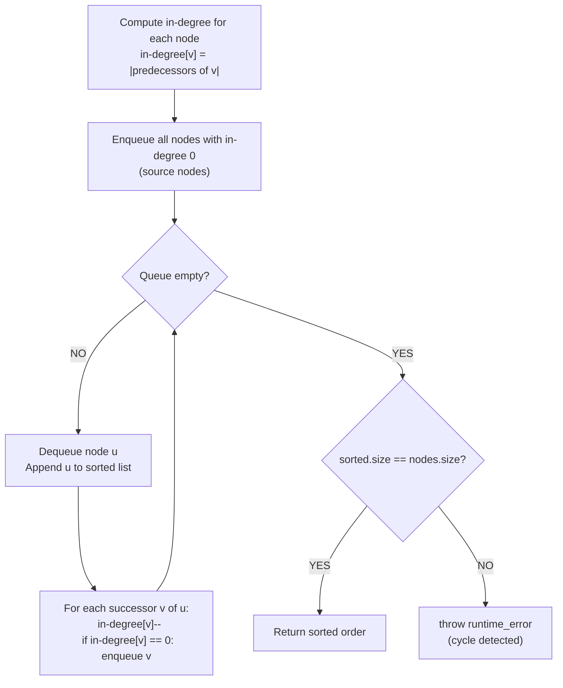
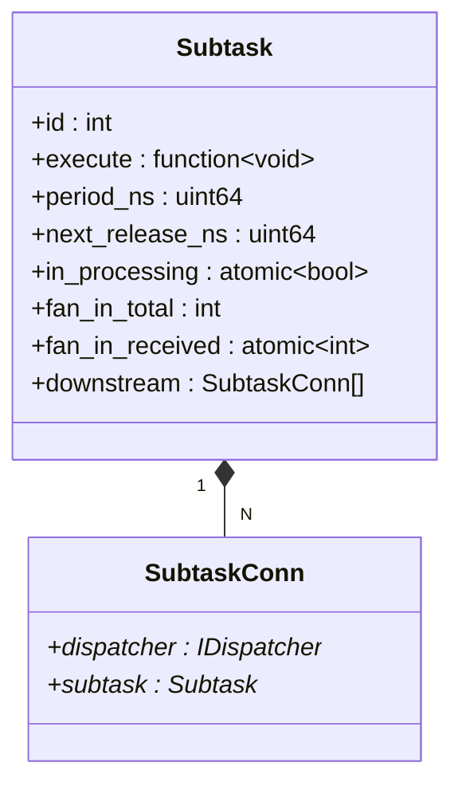
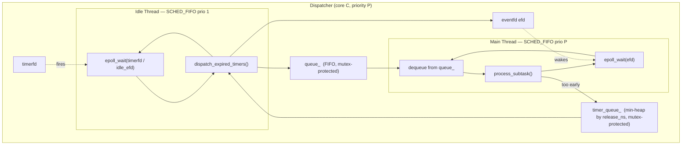
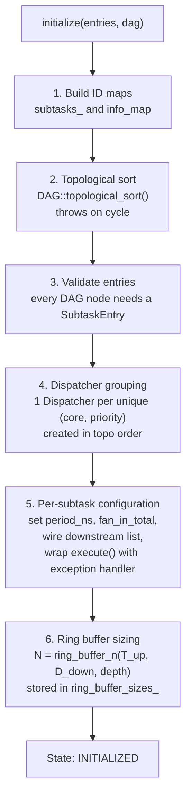
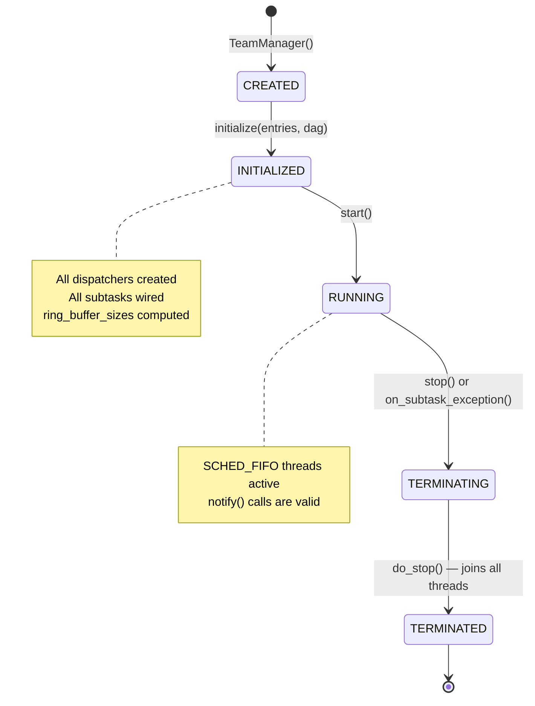
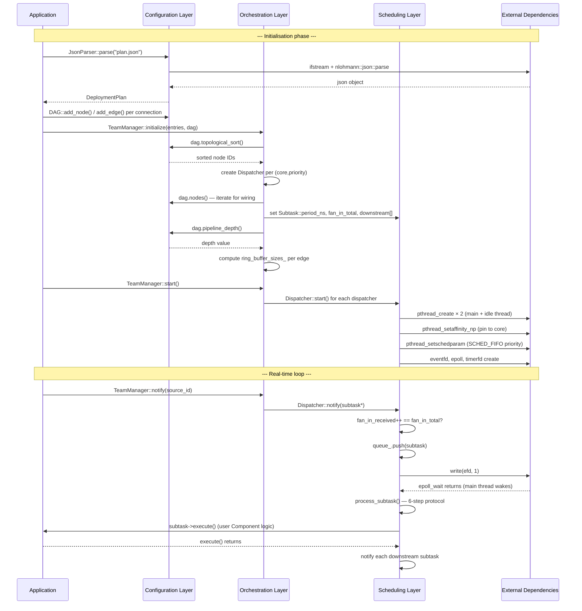

# MCFlow Middleware — Layers Deep Dive

> This document provides an in-depth technical description of the **Configuration Layer**, **Scheduling Layer**, **Orchestration Layer**, and **External Dependencies** of the MCFlow C++ middleware implementation, based on Huang et al., *"MCFlow: A Real-Time Streaming Framework for Multi-Core Platforms"*, IEEE RTCSA 2012.

---

## Table of Contents

1. [Architecture Overview](#1-architecture-overview)
2. [External Dependencies](#2-external-dependencies)
3. [Configuration Layer](#3-configuration-layer)
   - 3.1 [Deployment Plan — Data Model](#31-deployment-plan--data-model)
   - 3.2 [JSON Parser](#32-json-parser)
   - 3.3 [Directed Acyclic Graph (DAG)](#33-directed-acyclic-graph-dag)
4. [Scheduling Layer](#4-scheduling-layer)
   - 4.1 [Subtask — The Runtime Unit of Work](#41-subtask--the-runtime-unit-of-work)
   - 4.2 [Dispatcher — The Thread Manager](#42-dispatcher--the-thread-manager)
   - 4.3 [The 6-Step Release-Guard Protocol](#43-the-6-step-release-guard-protocol)
   - 4.4 [Fan-In Synchronisation](#44-fan-in-synchronisation)
   - 4.5 [Periodic Scheduling and the Timer Queue](#45-periodic-scheduling-and-the-timer-queue)
5. [Orchestration Layer](#5-orchestration-layer)
   - 5.1 [TeamManager Responsibilities](#51-teammanager-responsibilities)
   - 5.2 [Lifecycle State Machine](#52-lifecycle-state-machine)
   - 5.3 [Dispatcher Grouping Strategy](#53-dispatcher-grouping-strategy)
   - 5.4 [Automatic DAG Wiring](#54-automatic-dag-wiring)
   - 5.5 [Ring Buffer Sizing](#55-ring-buffer-sizing)
   - 5.6 [Exception Handling and Emergency Stop](#56-exception-handling-and-emergency-stop)
6. [Cross-Layer Interaction](#6-cross-layer-interaction)

---

## 1. Architecture Overview

The middleware is organised into four layers stacked from the most static to the most dynamic:



Each layer has a clear responsibility boundary. The **Configuration Layer** is purely static and contains no runtime behaviour. The **Scheduling Layer** is purely mechanical — it executes subtasks according to timing rules without knowing what they do or why. The **Orchestration Layer** bridges the two: it reads configuration and constructs the live scheduling objects.

---

## 2. External Dependencies

The project depends on two categories of external resources: the POSIX operating system interface and the nlohmann/json header-only library.

### 2.1 POSIX Threading — `pthreads`

All threads in the middleware are created with the POSIX `pthread` API rather than C++11 `std::thread`, because only `pthreads` exposes the real-time scheduling attributes required by the paper.

**Key functions used:**

| Function | Purpose |
|---|---|
| `pthread_create` | Creates a new thread (one main + one idle per Dispatcher) |
| `pthread_join` | Blocks until a thread finishes — used during `stop()` to ensure clean shutdown |
| `pthread_setaffinity_np` | Pins a thread to a specific CPU core via a `cpu_set_t` bitmask |
| `pthread_setschedparam` | Sets the scheduling policy to `SCHED_FIFO` and the real-time priority level |
| `pthread_mutex_init/lock/unlock/destroy` | Protects the ready queue and the timer queue inside each Dispatcher |

**`SCHED_FIFO` semantics:** under Linux's `SCHED_FIFO`, a thread runs until it voluntarily blocks or is preempted by a higher-priority `SCHED_FIFO` thread. There is no time-slicing between threads of equal priority. This matches the paper's partitioned fixed-priority model: within a core, higher-priority dispatchers always preempt lower-priority ones, and within a single priority level subtasks execute to completion without interruption.

Calling `pthread_setschedparam` with `SCHED_FIFO` requires the `CAP_SYS_NICE` Linux capability, which is equivalent to running as root. If the privilege is absent, the call fails and the dispatcher prints a warning to `stderr`; the system still functions but without real-time guarantees.

### 2.2 `eventfd` — Lightweight Event Notification

`eventfd` (Linux-specific) creates a file descriptor that acts as a semaphore: a `write(fd, 1)` increments a 64-bit counter, and a `read(fd, &val)` blocks until the counter is non-zero, then atomically reads and clears it.

The `EFD_SEMAPHORE` flag ensures that each `write` of value 1 produces exactly one unblocking `read` — multiple notifications are not collapsed. This property is critical: if three subtasks become ready before the dispatcher drains its queue, the three `write` calls produce three separate wakeups, ensuring all three subtasks are eventually processed.

Each `Dispatcher` owns two `eventfd` descriptors:
- `efd_` — signals the main thread that a subtask has been enqueued.
- `idle_efd_` — signals the idle thread to exit during `stop()`.

### 2.3 `epoll` — Scalable I/O Multiplexing

`epoll` allows a single thread to monitor multiple file descriptors with a single blocking call (`epoll_wait`). Each `Dispatcher` registers its `eventfd` with an `epoll` instance so the main thread can block on a single `epoll_wait` instead of spinning.

The idle thread uses a separate `epoll` instance that monitors both the `timerfd` and the `idle_efd_`, allowing it to wake up either on a timer expiry or on the shutdown signal — both through the same blocking call.

### 2.4 `timerfd` — Kernel-Managed Absolute Timers

`timerfd_create(CLOCK_MONOTONIC, ...)` creates a file descriptor that fires at a specified absolute time. The idle thread arms it via `timerfd_settime` with `TFD_TIMER_ABSTIME`, which specifies a time in nanoseconds on the `CLOCK_MONOTONIC` clock.

Using absolute time (`TFD_TIMER_ABSTIME`) is essential for strict periodicity: if a relative sleep were used instead (`nanosleep` by N ns), any delay in waking up would shift the next release time forward, causing cumulative drift. With absolute arming, the timer always fires at `next_release_ns` regardless of how long the previous job took.

### 2.5 `CLOCK_MONOTONIC` — High-Resolution Timing

All time measurements in the middleware use `clock_gettime(CLOCK_MONOTONIC, ...)`, which returns nanosecond-resolution elapsed time since an arbitrary epoch. It is monotonic — it never goes backwards — making it safe for computing intervals and scheduling releases.

The static helper `Dispatcher::monotonic_ns()` wraps this call:

```cpp
static uint64_t monotonic_ns() {
    struct timespec ts;
    clock_gettime(CLOCK_MONOTONIC, &ts);
    return (uint64_t)ts.tv_sec * 1'000'000'000ULL + (uint64_t)ts.tv_nsec;
}
```

All `period_ns`, `deadline_ns`, and `next_release_ns` fields in the system are expressed in this same unit, so arithmetic is direct and lossless.

### 2.6 nlohmann/json — Header-Only JSON Library

`include/nlohmann/json.hpp` is a single-header C++11 JSON library. It is used exclusively in the Configuration Layer (by `parser_json.cpp`) and is never included in the Scheduling or Orchestration headers. This strict inclusion boundary ensures that the hot path (scheduling threads) compiles without the JSON library overhead.

The library is also used as the type of the `config` field in `SubtaskInfo` — component-specific configuration is stored as a raw `json` object and interpreted by the user's `Component::execute()` at runtime.

---

## 3. Configuration Layer

The Configuration Layer is responsible for representing, loading, and validating the deployment plan before any real-time activity begins. It is entirely static: once `TeamManager::initialize()` returns, no Configuration Layer object is mutated again.



### 3.1 Deployment Plan — Data Model

The deployment plan (`deployment_plan.hpp`) defines the complete description of a workload: which subtasks exist, how they are scheduled, and how they are connected. It is a collection of plain C++ structs with no methods.



**Field-by-field description of `SubtaskInfo`:**

| Field | Type | Description |
|---|---|---|
| `id` | `int` | Globally unique subtask identifier, used as the key in all maps |
| `task_id` | `int` | Parent task group; assigned by the parser from the enclosing task |
| `component_type` | `string` | String tag for the user's factory to instantiate the right `Component` subclass |
| `host` | `string` | Target hostname (currently unused at runtime; reserved for distributed extension) |
| `core` | `int` | CPU core index (0-based) on which this subtask's thread must run |
| `priority` | `int` | `SCHED_FIFO` priority (1–99 on Linux); higher values preempt lower ones |
| `period_ns` | `uint64_t` | Activation period in nanoseconds; 0 means aperiodic |
| `deadline_ns` | `uint64_t` | Relative deadline in nanoseconds; used by TeamManager to size ring buffers |
| `config` | `json` | Arbitrary key-value object passed to the component at construction |

**Why `period_ns` and `deadline_ns` are in nanoseconds:** the middleware uses `CLOCK_MONOTONIC` for all timing, which returns values in nanoseconds. Keeping all time quantities in the same unit eliminates conversion factors and potential precision loss in the hot path.

**The `config` field as a `json` object:** rather than defining a strongly typed configuration struct for each component type, the middleware stores the component's configuration as a raw JSON object. The component subclass extracts the fields it needs at construction time, before the real-time loop starts. This keeps `deployment_plan.hpp` independent of any user-defined types.

### 3.2 JSON Parser

`JsonParser` is a thin adapter that maps a JSON file to a `DeploymentPlan` struct. Its single public method is:

```cpp
DeploymentPlan parse(const std::string& filename);
```

Internally it delegates to four private methods, one per top-level JSON section:



The parser uses `json::value()` with a default for optional fields (`host`, `period_ns`, `deadline_ns`, `config`), so partially-specified subtasks are valid. Mandatory fields (`id`, `core`, `priority`, `component_type`) will throw a `nlohmann::json` exception if absent.

**Example JSON structure:**

```json
{
  "hosts": [
    { "name": "localhost", "address": "127.0.0.1" }
  ],
  "tasks": [
    {
      "id": 1,
      "subtasks": [
        { "id": 1, "component_type": "SourceA", "host": "localhost",
          "core": 0, "priority": 16, "period_ns": 1000000,
          "deadline_ns": 1000000, "config": {} },
        { "id": 2, "component_type": "FilterB", "host": "localhost",
          "core": 0, "priority": 16, "period_ns": 1000000,
          "deadline_ns": 1000000, "config": { "gain": 2.5 } },
        { "id": 3, "component_type": "SinkC",   "host": "localhost",
          "core": 0, "priority": 16, "period_ns": 1000000,
          "deadline_ns": 1000000, "config": {} }
      ]
    }
  ],
  "connections": [
    { "upstream": 1, "downstream": 2 },
    { "upstream": 2, "downstream": 3 }
  ]
}
```

After parsing, the `DeploymentPlan` is used to construct the `DAG` and passed to `TeamManager::initialize()`. It is not referenced at runtime.

### 3.3 Directed Acyclic Graph (DAG)

The `DAG` class (`dag.hpp` / `dag.cpp`) models the task graph as an adjacency list and exposes three algorithms consumed by the Orchestration Layer.

#### 3.3.1 Internal Representation

```cpp
struct Node {
    int id;
    std::vector<int> predecessors;   // incoming edge sources
    std::vector<int> successors;     // outgoing edge targets
    ComponentBase*   component;      // optional pointer to the Component
};
```

Edges are stored redundantly in both directions: each node's `successors` list mirrors the `predecessors` lists of its downstream nodes. This bidirectional representation makes all three algorithms O(V+E) without additional data structures.

#### 3.3.2 Topological Sort — Kahn's Algorithm

```cpp
std::vector<int> DAG::topological_sort() const
```

Kahn's algorithm processes nodes in breadth-first order starting from all nodes with in-degree zero (sources). Each time a node is output, the in-degrees of its successors are decremented; a successor is added to the queue when its in-degree reaches zero.



If the algorithm terminates with fewer nodes in `sorted` than in the graph, it means some nodes were never reachable from a zero-indegree start — which implies a cycle. This is the cycle detection mechanism used by `has_cycle()`.

**Why topological order matters for the middleware:** TeamManager uses this order to:
1. Create Dispatchers in source-to-sink order, ensuring that a downstream dispatcher's wiring can reference an already-created upstream dispatcher.
2. Compute `pipeline_depth` correctly (each node's depth is `max(predecessors' depths) + 1`).
3. Start dispatchers in source-to-sink order and stop them in sink-to-source order during shutdown.

#### 3.3.3 Pipeline Depth — Longest Path

```cpp
int DAG::pipeline_depth() const
```

Computed via dynamic programming on the topological order:

```cpp
for (int id : topological_sort()) {
    for (int succ : find_node(id)->successors)
        depth[succ] = max(depth[succ], depth[id] + 1);
}
```

Initial depth of each node is 1. After processing all nodes in topological order, the maximum value in `depth[]` is the length of the longest path, i.e. the number of stages that can hold a ring buffer slot simultaneously. This value feeds directly into the ring buffer sizing formula.

#### 3.3.4 Fan-In Count

```cpp
int DAG::fan_in_count(int id) const  // returns predecessors.size()
int DAG::fan_out_count(int id) const // returns successors.size()
```

These are simple lookups. `fan_in_count` is used by TeamManager to set `Subtask::fan_in_total`. A source node returns 0, but TeamManager enforces a minimum of 1 so that the first `notify()` call always enqueues the subtask.

---

## 4. Scheduling Layer

The Scheduling Layer contains the runtime machinery that actually executes subtasks. It is implemented entirely in `dispatcher.hpp` (a single header file, intentionally self-contained to minimise compilation dependencies on the real-time path).

Its key design principles are:
- **Zero dynamic allocation after `start()`** — all queues and objects exist before threads are launched.
- **Event-driven blocking** — threads never spin waiting for work; they block on `epoll_wait`.
- **Atomic-only shared state** — the only data shared between threads without a mutex is `in_processing` and `fan_in_received`, both `std::atomic`.

### 4.1 Subtask — The Runtime Unit of Work

`Subtask` is a plain C++ struct (not a class) that carries all the information the dispatcher needs to schedule and execute one unit of computation:



`Subtask` does not know about `Component` — the `execute` field is an opaque `std::function<void()>`. This decoupling is intentional: the Scheduling Layer is responsible for *when* to run the function, not *what* the function does.

**`Subtask` is non-copyable** because `std::atomic` members have deleted copy constructors. All `Subtask` objects must be heap-allocated and referenced by raw pointer in queues and lambdas. This is consistent with the real-time design goal of avoiding unexpected allocations.

**`downstream` as the wiring mechanism:** after `execute()` returns, the dispatcher iterates `subtask->downstream` and calls `notify()` on each `SubtaskConn`. This list is populated by the Orchestration Layer during `initialize()`, and the dispatcher never modifies it — creating a clean separation where topology belongs to configuration and triggering belongs to scheduling.

### 4.2 Dispatcher — The Thread Manager

Each `Dispatcher(core, priority)` manages exactly two POSIX threads, both pinned to `core`:



**Main thread (`SCHED_FIFO prio P`):** blocks on `epoll_wait(efd)` until a subtask is enqueued and `efd` is signalled. On wake-up it reads the `eventfd`, dequeues one subtask from `queue_`, and calls `process_subtask()`. After processing, it drains any remaining items in `queue_` without returning to `epoll_wait`, minimising context switch overhead when multiple subtasks become ready in quick succession.

**Idle thread (`SCHED_FIFO prio 1`):** blocks on an `epoll` instance that monitors both `timerfd` and `idle_efd_`. It wakes up when the kernel fires the `timerfd` at the next scheduled release time. It then calls `dispatch_expired_timers()`, which scans the `timer_queue_` min-heap, re-enqueues all entries whose `release_ns` has passed, and signals `efd` for the main thread. Because its priority is 1 (the minimum for `SCHED_FIFO`), it only executes when the core is otherwise idle — it never preempts a real subtask.

**Why the two-thread design is necessary:** a single-thread dispatcher cannot sleep waiting for a release time without blocking other subtasks in its queue. The idle thread solves this by taking over the timing responsibility at the lowest possible priority, ensuring it never competes with real work.

### 4.3 The 6-Step Release-Guard Protocol

`process_subtask(s)` implements a strict protocol derived from paper Section V-C. The six steps in order are:

**Step 1 — Dequeue** *(performed in `loop()` before `process_subtask` is called)*
The subtask pointer is removed from `queue_` under `queue_mutex_` before `process_subtask` is called.

**Step 2 — Leader/followers guard**
```cpp
if (s->in_processing.exchange(true)) return;  // skip if already running
```
An atomic compare-and-swap prevents double execution. This guard is required when a subtask has multiple upstream suppliers (fan-out from their perspective): two different dispatchers may call `notify(s)` almost simultaneously after their respective subtasks finish, both seeing `fan_in_received == fan_in_total` and both trying to enqueue `s`. The guard ensures only one execution proceeds per job.

**Steps 3 & 4a — Periodicity check**
```cpp
if (s->period_ns > 0 && s->next_release_ns > 0 && now < s->next_release_ns) {
    // too early: defer to timer queue
    s->in_processing.store(false);
    timer_queue_.push({s->next_release_ns, s});
    timerfd_settime(timerfd_, TFD_TIMER_ABSTIME, ...);
    return;
}
```
If the subtask is periodic and its release time has not yet arrived, it is moved to the `timer_queue_` and `in_processing` is cleared. The `timerfd` is re-armed at the earliest entry in the heap. This step implements the paper's distinction between *activation* (when a notification arrives) and *execution* (when the release time is reached).

**Step 4b — Advance release time**
```cpp
s->next_release_ns = (s->next_release_ns == 0)
    ? now + s->period_ns
    : s->next_release_ns + s->period_ns;
```
The next release time is advanced by exactly `period_ns`, **not** set to `now + period_ns`. This is the key to drift-free periodicity: each job's release is `k * period_ns` after the first release, regardless of execution jitter. Setting it to `now + period_ns` would cause every late execution to push the next deadline further, violating hard real-time guarantees.

On the very first job (`next_release_ns == 0`), it is initialised to `now + period_ns`, anchoring the schedule to the actual start time.

**Step 5 — Execute**
```cpp
s->execute();
```
The component's logic runs. This is the only step that involves user code. The dispatcher makes no assumptions about what happens inside `execute()` — it only enforces that this call is single-threaded per subtask and occurs at or after `next_release_ns`.

**Step 6 — Downstream propagation**
```cpp
for (auto& conn : s->downstream)
    conn.dispatcher->notify(conn.subtask);
s->in_processing.store(false);
```
After `execute()` returns, the dispatcher iterates the downstream list and calls `notify()` on each successor's dispatcher. This is a cross-dispatcher call (possibly on a different core) that is thread-safe because `notify()` only uses atomic operations and a mutex-protected push to the target queue. `in_processing` is cleared last, after all notifications are sent, to prevent a race where the same subtask could be re-triggered by a fast downstream before the current job finishes propagating.

### 4.4 Fan-In Synchronisation

When a subtask has multiple upstream suppliers, it must not execute until all of them have completed their job for the same activation cycle. The fan-in gate is implemented in `notify()`:

```cpp
void notify(Subtask* s) override {
    int received = s->fan_in_received.fetch_add(1) + 1;
    if (received < s->fan_in_total) return;   // still waiting
    s->fan_in_received.store(0);              // reset for next job
    // enqueue s and signal efd...
}
```

`fan_in_received` is an atomic integer. The `fetch_add` returns the old value; adding 1 gives the new count. If the count has not reached `fan_in_total`, the function returns immediately — no lock is needed for this common path. When the final supplier arrives, the counter is reset to zero and the subtask is enqueued.

**Known limitation:** the reset and enqueue are not atomic with respect to each other. In a scenario with job overlap (upstream period shorter than downstream period), a supplier for job N+1 may increment `fan_in_received` before job N has been dequeued, causing a spurious enqueue for job N. This is the primary known deviation from the paper (see `visao-arquitetural.md`, Deviation 1).

### 4.5 Periodic Scheduling and the Timer Queue

The `timer_queue_` is a standard C++ `std::priority_queue` configured as a min-heap:

```cpp
using TimerQueue = std::priority_queue<
    TimerEntry,
    std::vector<TimerEntry>,
    std::greater<TimerEntry>   // min-heap: smallest release_ns at top
>;
```

`TimerEntry` holds `(release_ns, Subtask*)`. When `process_subtask` defers a subtask, it pushes a `TimerEntry` and re-arms the `timerfd` at the new minimum:

```cpp
uint64_t earliest = timer_queue_.top().release_ns;
timerfd_settime(timerfd_, TFD_TIMER_ABSTIME, &its_from_ns(earliest), nullptr);
```

The idle thread's `dispatch_expired_timers()` drains all entries whose `release_ns <= now` back into `queue_`, then signals `efd` for each one. Because the idle thread runs at priority 1, it can only do this when no real subtask is executing on that core, ensuring it does not add jitter to higher-priority work.

---

## 5. Orchestration Layer

`TeamManager` is the single class of the Orchestration Layer. It is the bridge between the static world of the Configuration Layer and the dynamic world of the Scheduling Layer. Its primary job is to create, configure, and connect `Dispatcher` objects based on the information in a `DeploymentPlan` and a `DAG`.

### 5.1 TeamManager Responsibilities

TeamManager performs six distinct tasks during `initialize()` and then manages the lifecycle of all dispatchers:



### 5.2 Lifecycle State Machine

TeamManager enforces a strict state machine. Calling methods out of order throws `std::runtime_error`:



**State transitions in detail:**

- **`CREATED → INITIALIZED`:** `initialize()` acquires `state_mutex_` and checks `state_ == CREATED` before proceeding. It is the only method that allocates heap memory (Dispatchers, map entries). After it returns, all internal structures are immutable for the rest of the lifetime.

- **`INITIALIZED → RUNNING`:** `start()` calls `Dispatcher::start()` on each dispatcher in `dispatcher_order_` (topological creation order — sources first). This launches all POSIX threads. The state changes to `RUNNING` only after all `start()` calls return.

- **`RUNNING → TERMINATING`:** triggered either by the application calling `stop()` or by a subtask throwing an exception (which calls `on_subtask_exception()` from a dispatcher thread). The `on_subtask_exception()` path sets `state_ = TERMINATING` but does **not** call `do_stop()` — doing so would call `pthread_join` from a dispatcher thread, which would deadlock because the thread cannot join itself.

- **`TERMINATING → TERMINATED`:** `do_stop()` iterates `dispatcher_order_` in **reverse** (sinks first, then sources) and calls `Dispatcher::stop()` on each, which sets `running_ = false`, signals both `efd_` and `idle_efd_`, and joins both threads. After all joins, `state_ = TERMINATED`.

**`stop()` is idempotent:** it checks whether the state is already `TERMINATED` or `CREATED` (no threads were ever started) and returns early if so. This allows `stop()` to be safely called multiple times and from the destructor.

### 5.3 Dispatcher Grouping Strategy

The grouping strategy directly implements paper Section V-B: *"one thread per (core, priority) pair"*.

```cpp
// From team_manager.cpp::initialize():
for (int id : topo_order_) {
    CorePrio cp{info->core, info->priority};
    if (dispatchers_.find(cp) == dispatchers_.end()) {
        dispatchers_[cp] = std::make_unique<Dispatcher>(info->core, info->priority);
        dispatcher_order_.push_back(cp);
    }
    subtask_dispatcher_[id] = dispatchers_.at(cp).get();
}
```

The map `dispatchers_` is keyed by `CorePrio = std::pair<int,int>`. The first time a `(core, priority)` combination is seen in topological order, a new `Dispatcher` is created. Subsequent subtasks with the same combination share the existing dispatcher.

**Consequences of sharing within a dispatcher:**
- Subtasks at the same `(core, priority)` execute **serially** — the dispatcher's single thread processes them in FIFO order.
- There is no preemption between subtasks in the same dispatcher; only the Linux scheduler can preempt the entire dispatcher thread in favour of a higher-priority dispatcher thread on the same core.
- The total number of threads spawned is `2 × |unique (core, priority) pairs|`, regardless of the number of subtasks.

**`dispatcher_order_` for sequenced start/stop:**
The vector records the creation order (which follows topological sort). `start()` iterates it forward (sources before sinks) and `do_stop()` iterates it in reverse (sinks before sources). Stopping sinks first prevents a running source from `notify()`-ing a dispatcher that has already been shut down.

### 5.4 Automatic DAG Wiring

After all dispatchers are created, TeamManager configures each `Subtask` by reading the DAG node's adjacency information:

```cpp
// From team_manager.cpp::initialize():
for (const auto& node : dag.nodes()) {
    Subtask* s = subtasks_.at(node.id);

    s->period_ns    = info->period_ns;
    s->fan_in_total = max(1, (int)node.predecessors.size());
    s->fan_in_received.store(0);

    s->downstream.clear();
    for (int succ_id : node.successors)
        s->downstream.push_back({
            subtask_dispatcher_.at(succ_id),   // Dispatcher* of the successor
            subtasks_.at(succ_id)              // Subtask* of the successor
        });
}
```

The result is that every `Subtask::downstream` list is a fully resolved set of `(Dispatcher*, Subtask*)` pairs. When `process_subtask` calls `conn.dispatcher->notify(conn.subtask)` after execution, it does so without any map lookup or graph traversal — the resolution was done once at initialization time.

**Why this design is safe for real-time operation:** map lookups (`std::map::at`) involve O(log n) tree traversal and possible cache misses. By resolving all downstream pointers into a flat `std::vector<SubtaskConn>` at initialization time, the propagation path in the hot loop is a simple linear scan over a vector of two pointers — O(fan-out), cache-friendly, and allocation-free.

### 5.5 Ring Buffer Sizing

TeamManager pre-computes the recommended `N` for `RingBuffer<T, N>` for every DAG edge:

```cpp
int depth = dag.pipeline_depth();

for (const auto& node : dag.nodes()) {
    for (int down_id : node.successors) {
        ring_buffer_sizes_[{node.id, down_id}] = ring_buffer_n(
            up_info->period_ns,
            down_info->deadline_ns,
            depth
        );
    }
}
```

The formula (from `ring_buffer.hpp`):

```
N = next_pow2( max(2,  ceil(deadline_downstream / period_upstream)  +  pipeline_depth) )
```

**Rationale of each term:**

| Term | Meaning |
|---|---|
| `ceil(D_down / T_up)` | Maximum number of upstream jobs that can be in flight before the downstream deadline expires. This is the worst-case number of unconsumed slots. |
| `+ pipeline_depth` | Additional slots needed to cover simultaneous occupancy by all stages of the pipeline that lie between this producer and the final sink. |
| `max(2, ...)` | Minimum double-buffering: at least 2 slots so the producer can write the next job while the consumer reads the current one. |
| `next_pow2(...)` | Makes N a power of 2, enabling bitmask index wrapping (`seq & (N-1)`) instead of a modulo division. |

Because `RingBuffer<T, N>` requires `N` as a compile-time template parameter, this value is consulted by the code generation tool (Phase 6) to emit the correct `RingBuffer<T, N>` type instantiation. It is not used at runtime by the dispatcher itself.

### 5.6 Exception Handling and Emergency Stop

Before `initialize()` returns, TeamManager wraps each subtask's `execute` function with a try-catch block:

```cpp
auto original_fn = s->execute;
s->execute = [this, id, original_fn]() {
    try {
        original_fn();
    } catch (const std::exception& e) {
        std::cerr << "[TeamManager] subtask " << id << " threw: " << e.what() << "\n";
        on_subtask_exception(id);
    } catch (...) {
        std::cerr << "[TeamManager] subtask " << id << " threw unknown exception\n";
        on_subtask_exception(id);
    }
};
```

`on_subtask_exception()` transitions the state to `TERMINATING` under the `state_mutex_`. It intentionally does not call `do_stop()` because:

1. It is called from a dispatcher thread.
2. `do_stop()` calls `pthread_join` on all dispatcher threads.
3. A thread cannot join itself — this would deadlock.

Instead, `on_subtask_exception()` only changes the state. The application's main thread is responsible for polling `state()` and calling `stop()` when it detects `TERMINATING`. This design keeps the Orchestration Layer free of threading hazards.

---

## 6. Cross-Layer Interaction

The following diagram shows the complete interaction sequence from a JSON file to a single subtask execution, tracing every layer boundary crossing:



This sequence makes the layer boundaries explicit: the Configuration Layer is only involved during initialisation and never touched in the real-time loop. The Orchestration Layer acts as the mediator at startup, then steps aside. During execution, all activity is confined to the Scheduling Layer and the OS interfaces — the two fastest layers.

---

## References

- Huang et al., "MCFlow: A Real-Time Streaming Framework for Multi-Core Platforms", IEEE RTCSA 2012.
- Linux `man` pages: `epoll(7)`, `eventfd(2)`, `timerfd_create(2)`, `pthread_setschedparam(3)`, `sched(7)`.
- nlohmann/json documentation: https://json.nlohmann.me
- [`architecture.md`](architecture.md) — algorithm reference for DAG, ring buffers, and dispatcher.
- [`visao-arquitetural.md`](visao-arquitetural.md) — full relational graphs and execution flows.
