# Architectural Overview — MCFlow Middleware

> C++ implementation of Huang et al., *"MCFlow: A Real-Time Streaming Framework for Multi-Core Platforms"*, IEEE RTCSA 2012.
>
> This document focuses on **relational graphs, execution flows, and detailed functional descriptions**. For algorithm reference and paper compliance, see [`architecture.md`](architecture.md).

---

## 1. System Overview

### The problem MCFlow solves

Modern embedded and control systems process data in pipelines: a sensor generates samples, a filter processes them, a controller makes decisions, an actuator responds. Each stage has a deadline: if the controller does not produce its output within 1 ms, the physical system may fail.

On multicore platforms the problem grows more complex: different pipeline stages must run on different cores simultaneously, yet each stage can only start after the previous one finishes. There is a simultaneous data dependency and time dependency. If any stage is late, all subsequent ones miss their deadlines too.

MCFlow solves this with a middleware that:
1. Represents the pipeline as a **DAG** (directed acyclic graph) of subtasks.
2. Each subtask is **pinned to a fixed core and priority** (`SCHED_FIFO`), eliminating CPU migration unpredictability.
3. Subtasks communicate through **lock-free, cache-line-aligned ring buffers** with no copy overhead and no mutexes.
4. Automatic activation of downstream subtasks happens **inside the dispatcher**, not in user code.

### Full system lifecycle

```
Before real time:
  JSON → parse → DeploymentPlan
               → DAG constructed
               → TeamManager::initialize()
                    → Dispatchers created (1 per core,priority pair)
                    → Automatic downstream wiring
                    → RingBuffers sized
  → TeamManager::start()  → SCHED_FIFO threads active

Real-time loop (application):
  on each tick:
    TeamManager::notify(source_id)
      → Dispatcher::notify(subtask_source)
        → fan-in gate passes
          → source execute() runs (core 0, high priority)
            → writes to RingBuffer
          → Dispatcher automatically notifies downstream
            → intermediate execute() runs (core 1)
              → reads upstream RingBuffer, writes downstream RingBuffer
            → Dispatcher notifies sink
              → sink execute() runs (core 2)

Shutdown:
  TeamManager::stop()
    → stops dispatchers in reverse order (sinks first)
    → joins all threads
```

MCFlow is a real-time middleware for multicore systems that executes directed acyclic graphs (DAGs) of periodic tasks with deadline constraints. Its pillars are:

- **Partitioned fixed-priority scheduling** — each subtask is pinned to a CPU core and a `SCHED_FIFO` priority; tasks with the same `(core, priority)` pair share a single dispatcher thread.
- **Lock-free ring buffers** — inter-subtask communication without busy waiting or *false sharing*.
- **Event-driven dispatch** — threads block on `epoll`/`eventfd`; idle cores consume no CPU.
- **Static allocation** — all resources are created during `initialize()`, before the real-time loop.

### Module Table

| File | Layer | Responsibility |
|---|---|---|
| `deployment_plan.hpp` | Configuration | Structs `DeploymentPlan`, `TaskInfo`, `SubtaskInfo`, `ConnectionInfo` |
| `parser_json.hpp/.cpp` | Configuration | Loads JSON → `DeploymentPlan` |
| `dag.hpp/.cpp` | Configuration | Directed acyclic graph; topological sort (Kahn); depth; cycle detection |
| `component.hpp` | Component | Templates `ComponentBase`, `Component<I,O,C>`, `SourceComponent<O,C>`, `SinkComponent<I,C>` |
| `adapter.hpp` | Component | Type conversion between upstream output and downstream input |
| `ring_buffer.hpp` | Data | `RingBuffer<T,N>` (SPSC) and `MultiSupplierRingBuffer<T,N,S>` (fan-in) |
| `dispatcher.hpp` | Scheduling | `Subtask`, `Dispatcher`, 6-step protocol, timer queue |
| `team_manager.hpp/.cpp` | Orchestration | Lifecycle, `(core,priority)` grouping, DAG wiring |

---

## 2. File Dependency Graph

Shows which files include which. Each arrow represents an `#include` relationship.

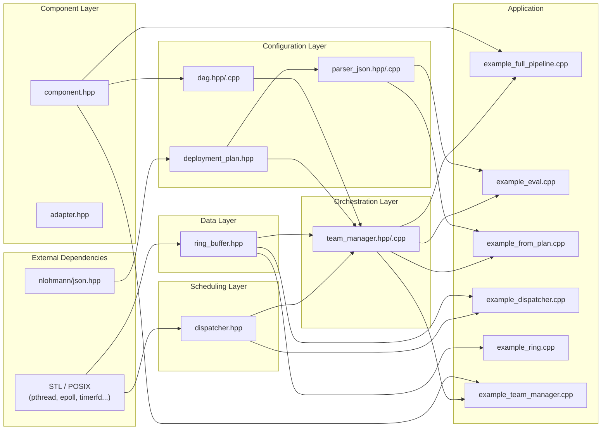

### Why this layer separation exists

The **Configuration Layer** (`deployment_plan.hpp`, `parser_json`, `dag`) exists at configuration time, not execution time. `DeploymentPlan` is a pure data structure with no behaviour. The `DAG` is built once before `initialize()` and then only queried — never modified during the real-time loop.

The **Data Layer** (`ring_buffer.hpp`) depends on no other project layer. This is intentional: buffers are the only structure shared between threads during execution, and they must be completely independent of scheduling logic to guarantee lock-freedom.

The **Scheduling Layer** (`dispatcher.hpp`) depends only on POSIX — not on configuration or components. A `Dispatcher` does not know what subtasks do, only when and where to run them. This allows swapping the dispatcher implementation without touching user code.

The **Orchestration Layer** (`team_manager`) is the only one that sees all the others. It reads the configuration, builds dispatchers, and resolves the mapping between the static world (DAG, DeploymentPlan) and the dynamic world (Subtasks, Dispatchers).

**Application code** includes only what it needs. Examples that do not use TeamManager (such as `example_ring`) are completely decoupled from the scheduling layer.

---

## 3. Class Hierarchy

### 3.1 Components and Adapters

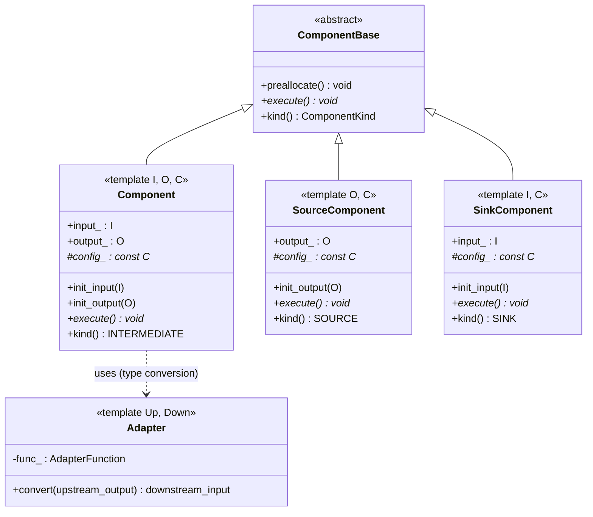

#### How components work in practice

The model is based on template inheritance. Users do not inherit from `ComponentBase` directly — they inherit from one of the three templates with their concrete types:

```cpp
// Example intermediate component:
struct MyFilter : Component<SensorData, FilteredResult, FilterConfig> {
    void execute() override {
        // this->input_ was filled by upstream via RingBuffer
        // this->config_ points to configuration loaded from JSON
        output_ = apply_filter(input_, *config_);
        // the dispatcher will write output_ to the downstream RingBuffer
    }
};
```

**Why templates instead of pure virtual?** Templates expose `input_type` and `output_type` as compile-time type aliases. This allows `RingBuffer<T,N>` to be instantiated with the exact data type — no boxing, no extra copy, and slot size known at compile time for cache-line alignment.

**What does `preallocate()` do?** It is called exactly once before `start()`. It lets the component allocate memory (vectors, internal buffers) outside the real-time loop. Inside `execute()`, ideally `new` or `malloc` are never called — all memory is already reserved.

**When to use each type:**
- `SourceComponent` — generates data without consuming input (sensor, signal generator, file reader). Has only `output_` and `config_`.
- `SinkComponent` — consumes data without producing output (log writer, network sender, actuator). Has only `input_` and `config_`.
- `Component` — transforms: reads `input_` and fills `output_`. Most intermediate pipeline nodes use this.

**The role of `Adapter<Up, Down>`:** when two components have incompatible types — for example, a `SourceComponent<RawBytes>` connected to a `Component<DecodedFrame, ...>` — the `Adapter` encapsulates a function `RawBytes → DecodedFrame`. Currently not automatically wired by TeamManager (see deviation #2 in section 12).

---

### 3.2 Scheduling

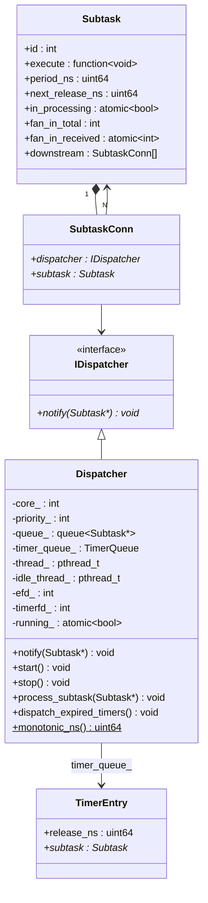

#### What each `Subtask` field represents

`Subtask` is the **runtime unit of work**. It does not know about `Component` — it only carries an opaque `std::function<void()>`. The TeamManager fills this field with a lambda that captures the concrete `Component` pointer and the associated `RingBuffer`.

| Field | Purpose |
|---|---|
| `execute` | Lambda generated by the user or TeamManager; calls `component->execute()` and reads/writes RingBuffers |
| `period_ns` | 0 = aperiodic (runs immediately every time); > 0 = period in nanoseconds (CLOCK_MONOTONIC) |
| `next_release_ns` | Absolute time of the next allowed release; 0 on first job (runs immediately) |
| `in_processing` | `atomic<bool>` — prevents double execution when two notifications arrive before `execute()` finishes |
| `fan_in_total` | How many upstream suppliers must notify before enqueueing; set by TeamManager as `dag.fan_in_count(id)` |
| `fan_in_received` | Atomic counter; when `fan_in_received == fan_in_total`, the subtask is enqueued and the counter is reset to zero |
| `downstream` | List of `SubtaskConn` filled by TeamManager; the dispatcher iterates this list after `execute()` to propagate automatically |

**Why is `Subtask` non-copyable?** The `in_processing` and `fan_in_received` fields are `std::atomic`, which has no copy constructor. This forces heap allocation via `unique_ptr` and reference by raw pointer in lambdas and dispatcher queues — exactly what a real-time system needs to avoid unexpected allocations.

**`IDispatcher` as an abstract interface:** the interface exists because `SubtaskConn` needs to point to a dispatcher without knowing whether it is the standard `Dispatcher` or a preemptive variant (`PreemptiveDispatcher`). This allows mixing dispatcher types in the same pipeline in the future.

**`TimerQueue` (min-heap):** stores periodic subtasks that arrived before their `next_release_ns`. The idle thread drains this queue when the core is free, moving expired subtasks back into the main `queue_`.

---

### 3.3 Orchestration and Configuration

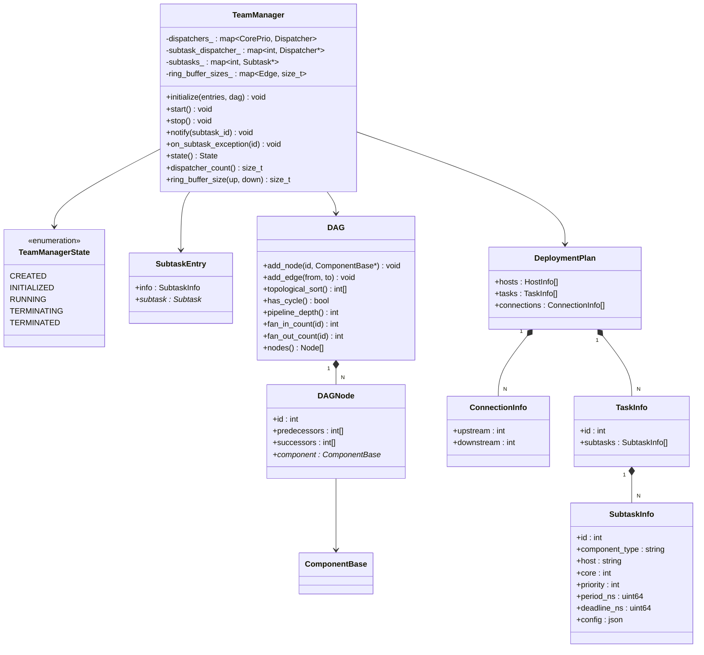

#### How TeamManager connects everything

`SubtaskEntry` is the **contract between the application and TeamManager**: the user provides the `SubtaskInfo` (scheduling metadata, from JSON or manually constructed) and the pointer to the concrete `Subtask` (which the user created and whose `execute` they defined). TeamManager does not own the `Subtask` — it only organises it.

**Internal maps and their purposes:**

| Map | Key | Value | Use |
|---|---|---|---|
| `dispatchers_` | `(core, priority)` | `unique_ptr<Dispatcher>` | Sole owner of dispatchers; guarantees 1 per pair |
| `subtask_dispatcher_` | `subtask_id` | `Dispatcher*` | O(log n) lookup at `notify(id)` time |
| `subtasks_` | `subtask_id` | `Subtask*` | Lookup for downstream wiring |
| `ring_buffer_sizes_` | `(upstream_id, downstream_id)` | `size_t N` | Value queried by codegen (Phase 6) to instantiate `RingBuffer<T,N>` |

**What `ring_buffer_size(upstream_id, downstream_id)` returns:** the recommended `N` value for `RingBuffer<T, N>`. Because `N` is a template parameter (compile time), this method is consulted by code generation tools, not at runtime. It encapsulates the paper's formula: `next_pow2(max(2, ceil(D_down/T_up) + pipeline_depth))`.

**`on_subtask_exception()`:** when an `execute()` throws an exception, the handler injected by TeamManager calls this method. It changes the state to `TERMINATING` atomically (protected by `state_mutex_`), which the main thread detects and then calls `stop()`. This ensures that a subtask with a bug does not stall the system indefinitely.

---

### 3.4 Data Buffers

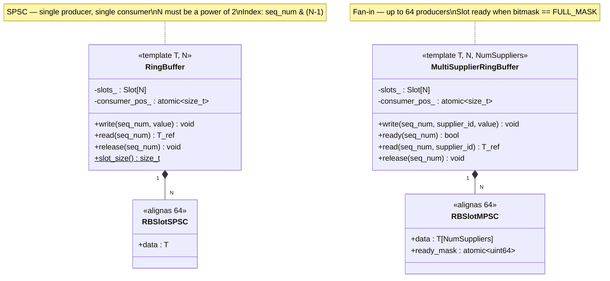

#### How the ring buffers work

**`RingBuffer<T, N>` (SPSC — Single Producer, Single Consumer):** used when one upstream subtask connects to exactly one downstream subtask. The producer calls `write(seq_num, value)` before notifying the downstream; the consumer calls `read(seq_num)` inside its `execute()` and `release(seq_num)` when done.

**`MultiSupplierRingBuffer<T, N, NumSuppliers>` (MPSC — fan-in):** used when several upstream subtasks converge on a single downstream node. Each supplier writes to its dedicated field in the slot (`data[supplier_id]`) and sets its bit in `ready_mask`. Only when all bits are set (`ready_mask == FULL_MASK`) can the consumer read.

**Why `alignas(64)` on each slot?** Each slot occupies exactly a multiple of 64 bytes — the cache-line size on x86-64. Without this, two adjacent slots could share the same cache line. If the producer writes to slot N and the consumer reads slot N-1, both would invalidate the same cache line on the other core — *false sharing* — causing latencies of tens of nanoseconds per access.

**Why is `consumer_pos_` on a separate cache line?** The producer reads `consumer_pos_` to check for backpressure. The consumer writes to it when calling `release()`. If they shared a cache line with the slots, every producer `write()` would invalidate `consumer_pos_` on the consumer side and vice versa.

**What is backpressure?** If the downstream has not yet consumed old slots, the producer **busy-waits** (`while (seq_num >= consumer_pos + N)`). This should never occur under normal conditions — correct sizing of `N` via the paper's formula guarantees enough slots for all in-flight jobs. If it does occur, the system is overloaded or a deadline has been violated.

**Why must N be a power of 2?** The slot index is computed as `seq_num & (N-1)` — a single-cycle bitmask operation. If N were not a power of 2, it would require `seq_num % N`, which is a division instruction (~20 cycles on x86-64).

---

## 4. Initialization Pipeline

Full flow from the JSON file to active real-time threads:

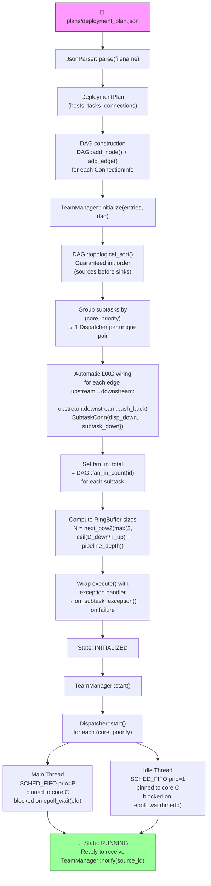

### Details of each step

**Why topological sort at initialization?** Kahn's algorithm guarantees that when processing node B, its predecessor A has already been processed. This is required to correctly compute each node's `pipeline_depth` — which depends on predecessors' depths — and to create Dispatchers in the right order (sources before sinks).

**What automatic DAG wiring does exactly:** for each edge `(upstream_id → downstream_id)` in the DAG, TeamManager:
1. Finds the pointer to the downstream `Subtask`.
2. Finds the `Dispatcher*` managing the downstream (via `subtask_dispatcher_`).
3. Pushes `SubtaskConn{dispatcher_downstream, subtask_downstream}` into `upstream->downstream`.

After this, the code inside `Dispatcher::process_subtask()` can iterate `subtask->downstream` and call `notify()` on each successor without any knowledge of the graph topology.

**Why are ring buffer sizes computed here?** Because `RingBuffer<T, N>` requires `N` at compile time. The `ring_buffer_size()` method computes the value of `N` and stores it for later use by the code generation tool (Phase 6). At runtime, buffers already exist with the correct size — nothing is allocated or recomputed.

**What the exception wrapper does:** TeamManager replaces `subtask->execute` with a lambda that wraps the original function:
```cpp
auto original = subtask->execute;
subtask->execute = [this, subtask_id, original]() {
    try {
        original();
    } catch (...) {
        on_subtask_exception(subtask_id);
    }
};
```
This catches any exception, prevents the dispatcher from crashing, and signals TeamManager that the system should enter an orderly shutdown.

---

## 5. Thread Model per Dispatcher

Each `Dispatcher(core C, priority P)` creates exactly **two POSIX threads**, both pinned to the same core:

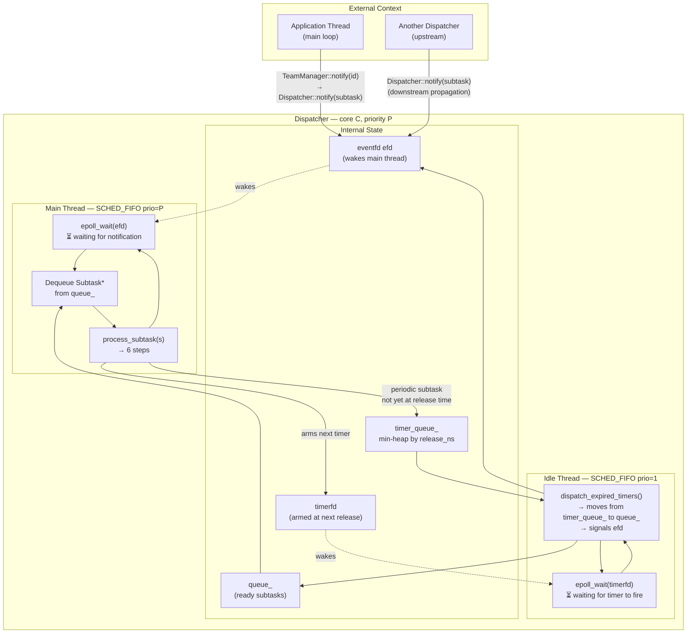

### Why two threads, not one?

**The problem without the idle thread:** if a periodic subtask arrives before its `next_release_ns`, the main thread cannot simply call `sleep()` or `nanosleep()` — this would block the processing of **other subtasks** that may already be in the queue and ready to run. The early subtask needs to be "parked" somewhere.

**Solution — idle thread:** the subtask is moved to the `timer_queue_` (min-heap), and the `timerfd` is armed for the exact moment of `next_release_ns`. The idle thread (priority 1, the lowest SCHED_FIFO priority) blocks on the `timerfd`. When the timer fires, it moves the subtask back to `queue_` and wakes the main thread via `efd`.

**Why does this work?** The idle thread only runs when the core is completely idle — because any subtask with priority ≥ 2 will preempt it. It therefore never delays real work; it only manages the clock in the background.

**Why `timerfd` instead of `nanosleep` or `clock_nanosleep`?** `timerfd` integrates with `epoll`, allowing the idle thread to monitor both the timer and the `idle_efd` shutdown signal with a single `epoll_wait`. Additionally, `timerfd` can be armed with absolute time (`TFD_TIMER_ABSTIME`), eliminating cumulative drift that chained relative sleeps would introduce.

**Priority view on core C:**
```
Priority P   → main thread        (executes real subtasks)
Priority P-1 → main thread of another Dispatcher on same core (if any)
...
Priority 2   → lowest Dispatcher on the core
Priority 1   → idle thread        (only manages timers when core is idle)
```

---

## 6. The 6-Step Release-Guard Protocol

The heart of real-time correctness in `Dispatcher::process_subtask()`. Prevents double execution and enforces strict periodicity.

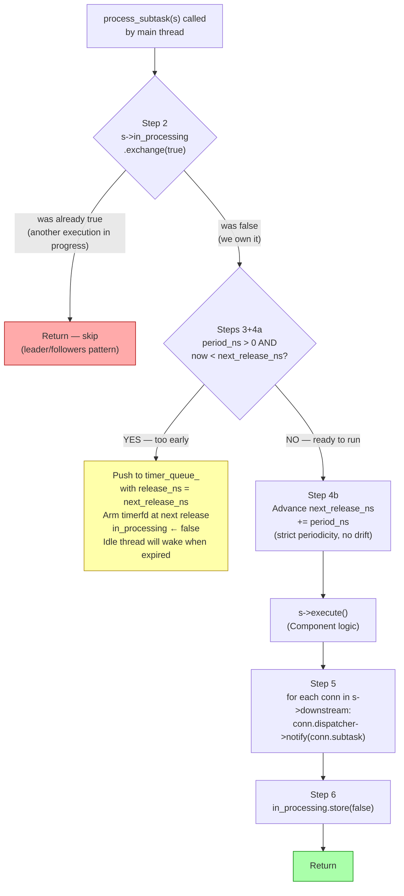

### What goes wrong if each step is omitted

**Without Step 2 (`in_processing`):** imagine a subtask with `fan_out = 2` — it notifies two downstream subtasks that both, in turn, notify the same subsequent subtask (convergence). The two notifications arrive almost simultaneously. Without the guard, the subtask would be processed twice for the same job, corrupting internal state and the downstream ring buffer.

**Without Step 4b (advancing `next_release_ns`):** Step 3 checks `now < next_release_ns`. If `next_release_ns` never advances, the subtask executes once and is then **permanently blocked** (always too early). Alternatively, if `next_release_ns` were updated using `now` instead of `next_release_ns + period_ns`, the period would accumulate drift: each job would be slightly later than the previous — violating the paper's strict periodicity guarantee.

**Without Step 5 (downstream propagation):** the pipeline stops completely after the first node. Each subtask only executes when it receives a notification; if nothing notifies the downstream, it stays blocked on `epoll_wait` forever. Step 5 is the "domino effect" that propagates activation through the entire DAG chain automatically.

**Without Step 6 (clearing `in_processing`):** the subtask executes once and never again — Step 2's guard permanently rejects all future notifications.

### Invariant exposed by Step 4b

When `execute()` runs, `next_release_ns` already points to the *next* release. Therefore, inside `execute()` it is possible to compute scheduling latency:

```cpp
// inside Component's execute():
uint64_t t_scheduled = subtask->next_release_ns - subtask->period_ns;
uint64_t t_actual    = Dispatcher::monotonic_ns();
uint64_t latency     = t_actual - t_scheduled;   // scheduling latency in ns
```

This is exactly what `example_eval.cpp` uses to measure jitter and deadline misses.

---

## 7. Data Flow Between Subtasks (Complete Sequence)

From the `notify()` call on the main thread to propagation through the entire pipeline:

```mermaid
sequenceDiagram
    participant App as Application (main)
    participant TM as TeamManager
    participant D0 as Dispatcher<br/>(core 0, prio 16)
    participant S1 as Subtask 1<br/>(source)
    participant RB as RingBuffer&lt;T,N&gt;
    participant D1 as Dispatcher<br/>(core 1, prio 14)
    participant S2 as Subtask 2<br/>(intermediate)

    App->>TM: notify(subtask_id=1)
    TM->>D0: notify(s1)

    Note over D0: fan_in_received++ == fan_in_total?
    D0->>D0: queue_.push(s1)
    D0->>D0: write(efd, 1) — wakes thread

    D0->>D0: epoll_wait returns
    D0->>D0: dequeue s1
    D0->>D0: process_subtask(s1)
    Note over D0: Step 2: in_processing ← true
    Note over D0: Step 4b: next_release_ns += period_ns

    D0->>S1: s1.execute()
    Note over S1: Reads config/state<br/>Produces output_
    S1->>RB: rb.write(seq_num, output_)
    S1-->>D0: returns

    Note over D0: Step 5: propagate downstream
    D0->>D1: notify(s2)
    Note over D0: Step 6: in_processing ← false

    D1->>D1: queue_.push(s2)
    D1->>D1: write(efd, 1)
    D1->>D1: dequeue s2
    D1->>D1: process_subtask(s2)
    D1->>S2: s2.execute()
    S2->>RB: rb.read(seq_num) — reads upstream data
    Note over S2: Processes input_ → output_
    S2->>RB: rb.release(seq_num)
    S2-->>D1: returns
    Note over D1: Propagates to next downstream...
```

### Sequence narrative

**1. Application activation:** the `main` thread calls `TeamManager::notify(1)` on each tick (for example, every 1 ms). TeamManager looks up `subtask_dispatcher_[1]` and calls `Dispatcher::notify(s1)` on the correct dispatcher.

**2. Fan-in gate:** `Dispatcher::notify()` atomically increments `fan_in_received`. If `fan_in_received < fan_in_total`, it returns without doing anything — still waiting for other suppliers. When all arrive, the counter is reset to zero (for the next job) and the subtask is pushed to `queue_`.

**3. Waking the main thread:** after enqueueing, `notify()` writes 1 to the `eventfd`. This wakes the main thread that was blocked on `epoll_wait`. Using `EFD_SEMAPHORE` ensures each `write(efd, 1)` corresponds to exactly one `read(efd, 1)` — no signals are lost.

**4. Execution:** the main thread unwraps the `Subtask*` from the queue and executes the 6-step protocol. Inside `execute()`, the concrete `Component` is responsible for reading the upstream `RingBuffer` (via `read(seq_num)`) and writing to the downstream `RingBuffer` (via `write(seq_num, value)`). The sequence number `seq_num` is managed by the user — typically a monotonic counter per pipeline.

**5. Automatic propagation:** at the end of `execute()`, the dispatcher iterates `s1->downstream` and calls `notify()` on each successor. From the `Component`'s perspective, propagation is **invisible** — it simply fills `output_` and returns. The wiring was done by TeamManager during `initialize()`.

**6. Real parallelism:** the `notify(s2)` call on Dispatcher D1 returns immediately (it only enqueues and signals D1's `efd`). D0 continues its execution (clears `in_processing`) while D1 — on another core — may already be executing S2. Both threads run in true parallel.

---

## 8. Pipeline Activation Graph

Example from `plans/deployment_plan.json`: 6 independent pipelines with Rate-Monotonic scheduling (shorter period → higher priority):

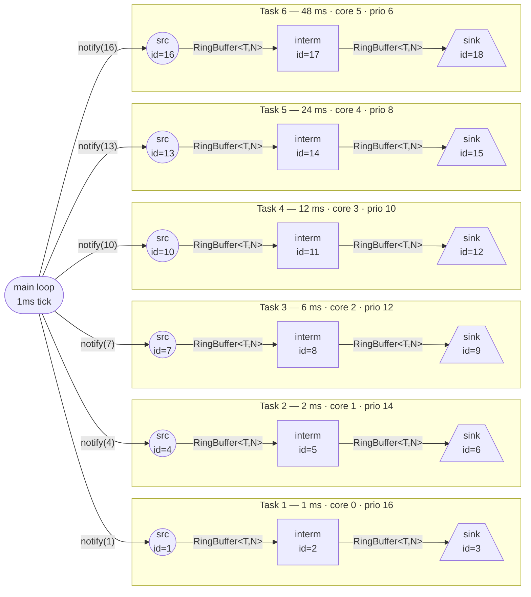

### RingBuffer sizing formula

```
N = next_pow2(max(2, ceil(D_downstream / T_upstream) + pipeline_depth))
```

| Variable | Meaning |
|---|---|
| `D_downstream` | Deadline of the downstream subtask (ns) |
| `T_upstream` | Period of the upstream subtask (ns) |
| `pipeline_depth` | Maximum DAG depth (nodes on the longest path) |
| `next_pow2` | Nearest power of 2 (ensures `seq & (N-1)` without modulo) |

### Why Rate-Monotonic Scheduling (RMS)?

RMS is optimal for sets of independent periodic tasks: if a task set is schedulable by any fixed-priority algorithm, it is schedulable by RMS. The rule is simple: **shorter period → higher priority**.

In the example above, Task 1 (1 ms) has priority 16 and Task 6 (48 ms) has priority 6. If both needed the same core (hypothetically), Linux would automatically preempt Task 6 when Task 1 became ready — because `SCHED_FIFO` with a higher priority preempts lower priority immediately.

**In the concrete example**, each task uses a different core, so there is no contention. RMS here is more a documentation of schedulability intent than a technical necessity. In scenarios where multiple pipelines share a core, RMS ensures that the shortest (and presumably most critical) deadlines are met first.

---

## 9. Dispatcher Grouping

Core rule from the paper (Section V-B): **one `Dispatcher` per `(core, priority)` pair**, not per subtask.

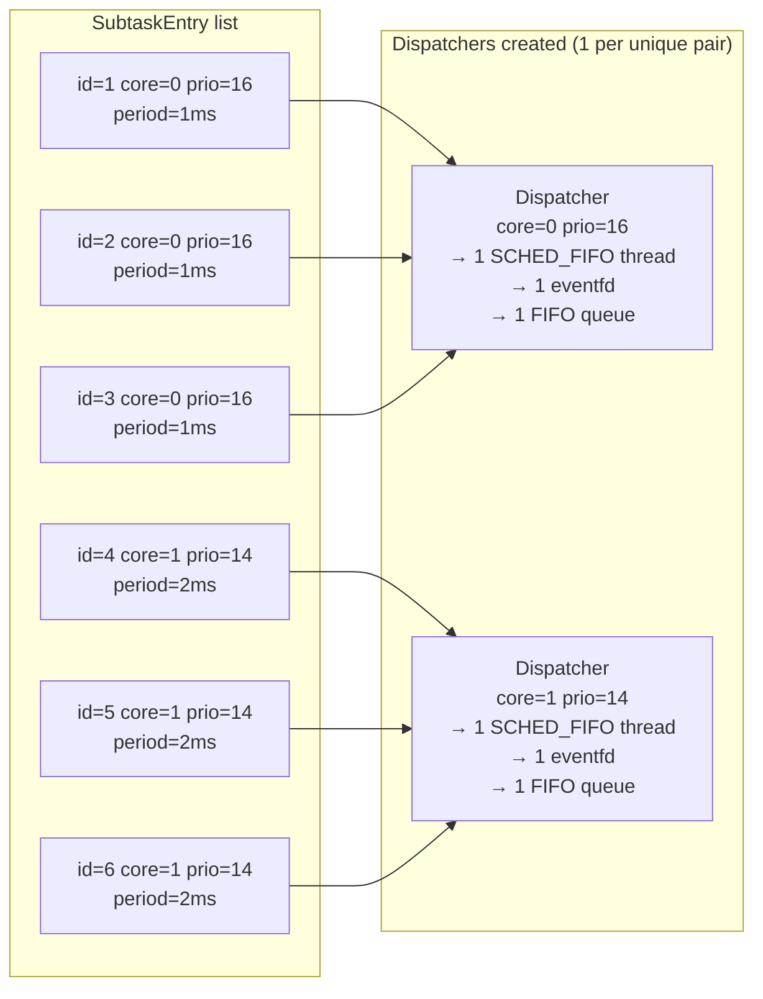

### Practical consequences of sharing

**Serial execution within a dispatcher:** subtasks that share the same `(core, priority)` execute **one at a time, in FIFO order**, inside the dispatcher's single thread. There is no parallelism between them — nor could there be, since they are all on the same core at the same priority.

**Why this is not a problem in MCFlow:** subtasks in the same linear pipeline typically have the same priority and core. Because they are activated in sequence (each notifies the next), they will never be in the queue at the same time — each `execute()` must finish before the next is notified, by the causality of the pipeline itself.

**Preemption between distinct dispatchers:** if core 0 has two dispatchers with priorities 16 and 14, and both their subtasks become ready simultaneously, the Linux scheduler ensures the priority-16 thread runs first. When it finishes (or blocks on `epoll_wait`), the priority-14 thread takes the core. This is the only point where real preemption occurs in the system.

**Advantage over one dispatcher per subtask:** creating one POSIX thread per subtask wastes resources (each thread requires ~8 KB stack by default, and `SCHED_FIFO` context switches have overhead even if light). With grouping, the number of threads is deterministic and minimal: exactly `|{unique (core, priority) pairs}|` × 2 (main + idle).

---

## 10. TeamManager State Machine

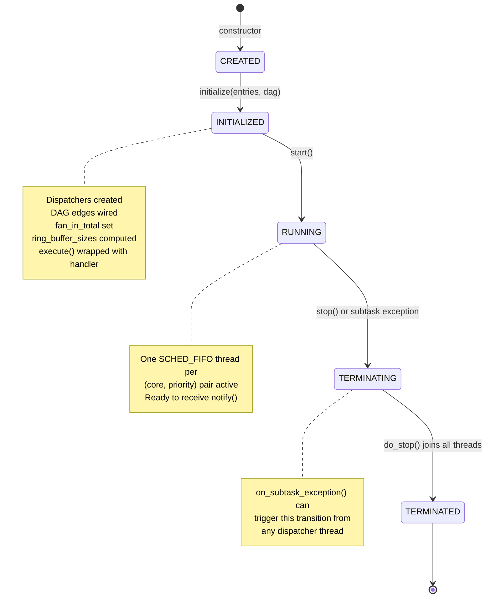

### Narrative of each transition

**`CREATED → INITIALIZED` via `initialize()`:** this is the most expensive transition and the only one that allocates resources. After it, the complete structure of dispatchers, downstream connections, and ring buffer sizes is determined and does not change again. It is intentionally irreversible — there is no `deinitialize()` method.

**`INITIALIZED → RUNNING` via `start()`:** launches the POSIX threads. The separation between `initialize()` and `start()` allows the application to configure everything (including ring buffers and components) before any real-time thread is active, eliminating race conditions during initialisation.

**`RUNNING → TERMINATING`:** can be triggered in two ways:
- **`stop()` called by the application:** normal path; the `main` thread decides to shut down.
- **`on_subtask_exception(id)` called by a dispatcher thread:** failure path; the state changes to `TERMINATING` atomically (protected by `state_mutex_`). The application must detect this by polling `state()` and then call `stop()`.

**`TERMINATING → TERMINATED` via `do_stop()`:** stops dispatchers in **reverse creation order** (sinks first, sources last). The reason is to ensure that no upstream continues sending data to an already-stopped downstream. After all joins, the state is `TERMINATED` and all resources are released by the destructor.

**`stop()` is idempotent:** may be called multiple times without side effects. Internally checks whether the state is already `TERMINATING` or `TERMINATED` before proceeding, protected by `state_mutex_`.

---

## 11. Examples and Tests Map

### Examples × Modules

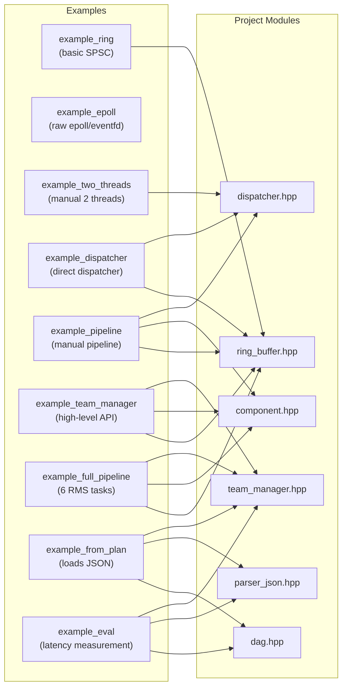

### What each example demonstrates

| Example | What it does | Learning point |
|---|---|---|
| `example_ring` | Writes and reads a `RingBuffer<int,4>` between two threads | How to use the ring buffer API; verifying backpressure |
| `example_epoll` | Demonstrates raw `epoll`/`eventfd` without dispatcher | Foundation of the wake-up mechanism used internally |
| `example_two_threads` | Two threads with a manual dispatcher | How `notify()` transfers control between threads |
| `example_dispatcher` | Direct dispatcher (no TeamManager): source→consumer, 1 second spacing | How to create and connect subtasks manually |
| `example_pipeline` | Manual linear pipeline with ring buffer | Full pattern: write on upstream, read on downstream |
| `example_team_manager` | High-level API with TeamManager | How to use the recommended API; initialize→start→notify→stop cycle |
| `example_full_pipeline` | 6 RMS pipelines, 18 subtasks, runs for 192 ms | Main demo; implicitly uses `plans/deployment_plan.json` |
| `example_from_plan` | Loads JSON, constructs DAG, and executes | How to integrate the parser with TeamManager |
| `example_eval` | Measures latency, jitter, deadline misses per subtask | Benchmarking tool; requires `sudo` for SCHED_FIFO |

> **Note on permissions:** `SCHED_FIFO` requires the `CAP_SYS_NICE` capability (equivalent to root). Without it, `pthread_setschedparam` fails silently and threads run at the default priority. The dispatcher prints a warning to stderr. For realistic latency results, run with `sudo ./example_eval plans/deployment_plan.json`.

### Tests × Modules

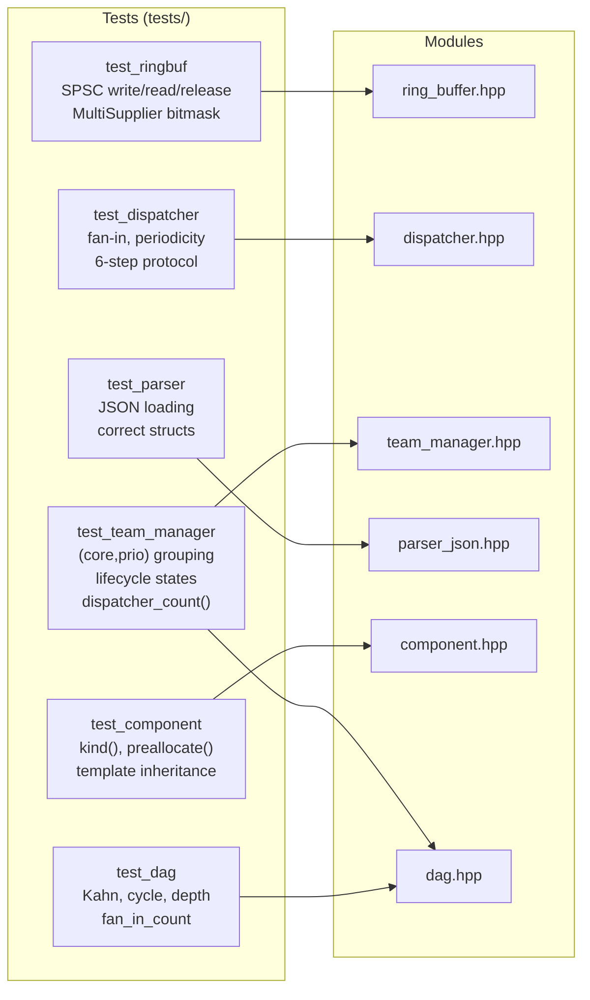

---

## 12. Known Deviations from the Paper

### Deviation 1 — 🔴 HIGH: Fan-in without per-job indexing

**Correct behaviour (paper):** for each fan-in edge, each supplier writes to the `MultiSupplierRingBuffer` indexed by `seq_num`. The consumer only reads when `ready(seq_num) == true`, i.e. when the slot's bitmask is complete. This guarantees that job N on the consumer uses exactly job N's data from each supplier.

**Current behaviour:** a global atomic counter `fan_in_received` per subtask. When `fan_in_received` reaches `fan_in_total`, the subtask is enqueued and the counter is reset.

**When this fails:** in deep pipelines where jobs overlap (e.g. T_upstream = 1 ms, T_downstream = 3 ms — up to 3 upstream jobs may be in flight simultaneously), notifications from job N+1 may increment `fan_in_received` before job N has been processed, causing job ordering confusion.

### Deviation 2 — 🟡 MEDIUM: Adapter not automatically wired

**Correct behaviour (paper):** when `output_type` of upstream ≠ `input_type` of downstream, the middleware transparently inserts an `Adapter` on the connection.

**Current behaviour:** `adapter.hpp` exists, but `TeamManager::initialize()` does not use it. Connections between incompatible types require the user to implement the conversion manually inside the component's `execute()` or to create a dedicated intermediate component for the conversion.

### Deviation 3 — 🟡 MEDIUM: Bulk shutdown instead of per-subtask cascade

**Correct behaviour (paper, Section V-D):** on shutdown, each subtask is individually signalled to stop and confirms shutdown before the next one is stopped. This allows clean draining of in-flight data.

**Current behaviour:** `stop()` stops all dispatchers at once in reverse creation order. Data that is still in transit in ring buffers may be lost if the downstream dispatcher is stopped before the upstream finishes writing.

### Deviation 4 — 🟢 LOW: Single host only

**Correct behaviour (paper):** `DeploymentPlan` supports multiple hosts, with a `Host Manager` on each node coordinating over the network.

**Current behaviour:** `HostInfo` exists in the structs and JSON, but there is no network layer. Everything runs in a single process. For distributed systems, the natural extension would be to replace `Dispatcher::notify()` with a network call when `host != localhost`.

### Deviation 5 — 🔵 INFO: Dead code in Dispatcher

`Dispatcher::subtasks_` (vector of `Subtask*`) and `register_subtask()` exist in the code but are never used by TeamManager. TeamManager manages subtask pointers in its own maps. These fields are remnants of an earlier version of the API.

### Deviation 6 — 🔵 INFO: Code generation (Phase 6) pending

`tools/codegen.cpp` exists but is incomplete. The goal is to read a `plans/deployment_plan.json` and automatically generate the C++ code with `RingBuffer<T,N>` instantiated with the correct `N` values, the specialised `Component` types, and a `Makefile`. Currently the user must instantiate these types manually based on `ring_buffer_size()` values.

---

## References

- Huang et al., "MCFlow: A Real-Time Streaming Framework for Multi-Core Platforms", IEEE RTCSA 2012.
- [`architecture.md`](architecture.md) — detailed technical reference for algorithms and interfaces.
- [`conceitos-fundamentais.md`](conceitos-fundamentais.md) — supplier/consumer, fan-in, cache-line, backpressure concepts.
- [`conformidade-huang2012.md`](conformidade-huang2012.md) — full paper ↔ implementation mapping.
